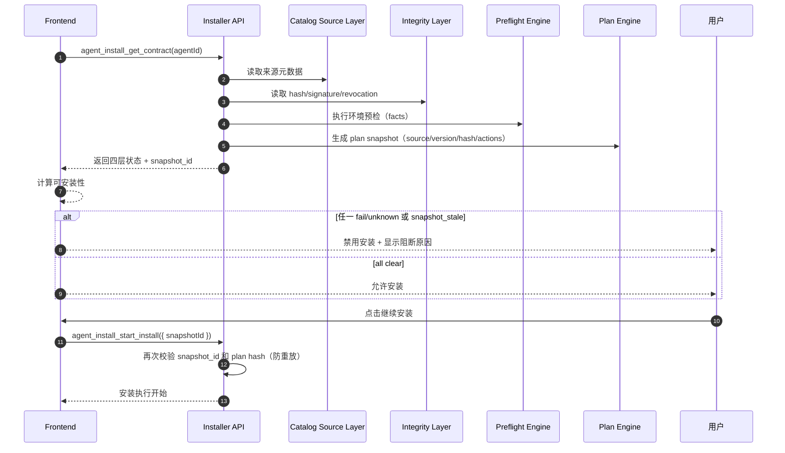

# 概要设计：FyAgent 安装四层决策链路（#25–#28）

## 1. 设计定位
这是一个“状态可信度产品化”任务，不是单一功能开发：目标是把安装展示从单点成功变为四层证据系统，避免用户把“安装了才算成功”误解为“来源可信”。

## 2. 流程总图

## 3. 依赖关系与顺序
- `#25` 提供 source layer（先于 #26/#27/#28）
- `#26` 提供 integrity layer（先于 #28）
- `#27` 提供环境判断（先于 #28）
- `#28` 汇总前三层并控制计划重确认

## 4. 风险登记与应对
- 循环依赖风险：plan 需要 source 和 version，version 依赖外部 release 元数据。
  - 应对：plan layer 使用 `release_id + catalog snapshot + integrity baseline` 的快照版本化引用，避免运行时回查。
- 重复职责风险：后端校验与前端提示重复定义。
  - 应对：后端只输出状态码/字段；前端只负责解释+动作提示，不重复验证。
- 失效前提风险：当上游 release API 不提供 signer 或 revocation 时。
  - 应对：进入 `unknown`，明确显示“尚未观察到”。

## 5. 可交付方案对比

### 方案 A（推荐）：四层契约 + plan snapshot 阻断
- 优点：契约清晰，证据完整，最小改动对齐现有 install pipeline
- 缺点：涉及多字段联调与文案统一

### 方案 B：只改前端文案，不改后端
- 优点：速度快
- 缺点：用户依然无法区分来源/完整性/环境，违背不可静默变化目标

### 方案 C：先后端再前端
- 优点：强底层一致性
- 缺点：前期无法验收 UI 变更，排期更长

**推荐：方案 A + 阶段性上线**

## 6. 里程碑（示意）
- M1：数据模型 freeze 与接口字段定义（#25/#26/#27）
- M2：前端四层面板与状态规则（含 unknown）
- M3：plan snapshot 重确认与阻断闭环（#28）
- M4：文案校准 + stale-reference 清理 + 交付评审

## 7. 决策点（提交给主会话确认）
1. `warn` 是否允许安装？（建议允许，带高亮修复建议）
2. `distribution_allowed=false` 是否直接 fail 还是可观测态？（建议 fail）
3. 何时展示 signer/revocation 详细证据？（建议进卡片展开）

## 8. 下级任务与同步建议
- 对每个 Issue 建议建立子执行任务，由**赖永杰**单独串行执行：
  - #25：source contract 与许可边界字段
  - #26：integrity 证据字典
  - #27：preflight 码表 + unknown
  - #28：snapshot 与重确认
- 每个子任务独立验收，合并时需通过跨层契约检查（snapshot 一致）。
