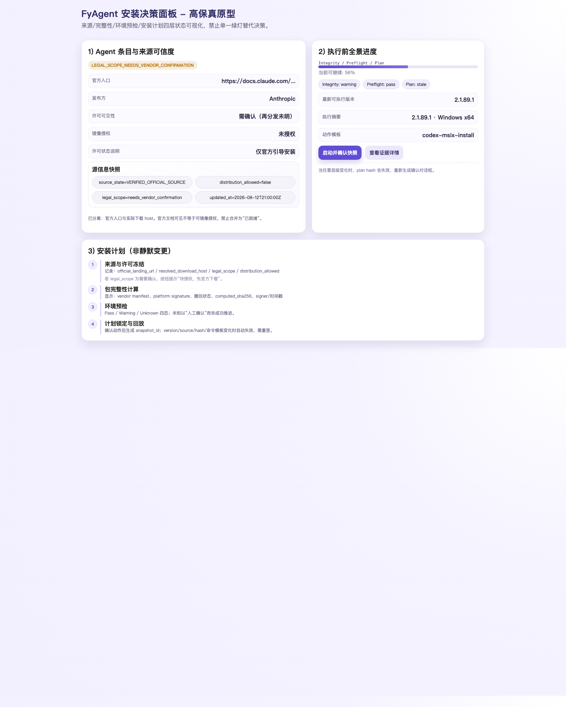

# PRD：FyAgent 安装链路组（#25/#26/#27/#28）一体化执行计划

## 一句话组级结论
把安装决策改为「来源可信」与「包完整」与「环境可装」与「安装计划冻结」四层可回读契约；前端只展示可追溯证据，不把三层缺口掩盖为一个“可安装”绿灯。

## 0. 交付目标与边界
- 目标：输出可执行 PRD 与设计包，覆盖 Issue #25/#26/#27/#28，并把高保真原型、前后端状态契约与执行拆分一并落盘。
- 非目标：不改动现有联网策略（不发模型请求）；不新增 challenge/runner；不建设云端托管与复杂密钥服务；不在软件内承诺人工验证已完成。
- 冻结约束承接：#35/#41/#49/#50/#51 的旧方向约束不改写。
- 交付物：
  - 高保真原型图：`prototype/installer-decoder-prototype.png`
  - PRD、详细设计、前端设计、概要设计三份文本
  - 下阶段子执行清单见公开合同，不再使用 Sol-fast 分发

**执行面更正（2026-08-18）：** 四层契约挂在新域 `agent_install_*`，**不是**
`GET /codex-desktop/install/{id}/contract`。Codex Desktop MSIX 保持原锁定
IPC。公开说明见
[`docs/fyagent/development/agent-install-contract.md`](../../../docs/fyagent/development/agent-install-contract.md)。

## 1. 用户问题清单（Issue 组视角）

### P1：来源链路误判（Issue #25）
- 问题：界面经常将“官方入口展示”与“许可/镜像授权”混为同一状态。
- 需求：catalog/source metadata 要拆成可回读字段。
- 影响面：用户可能无法区分“官方来源 + 未确认可再分发”与“官方来源且允许镜像”的差别。

### P2：包校验可信不足（Issue #26）
- 问题：当前验签与撤回证据常被 UI 降维为单一 hash 通过。
- 需求：把 `hash/签名/撤回` 做为同层多因子，增加 `unknown`。
- 影响面：单点验签失败/未发现撤回会误导到“已安全”状态。

### P3：环境预检语义不完整（Issue #27）
- 问题：环境预检缺失 `unknown` 分支，异常时被前端当作通过。
- 需求：preflight 必须返回 `pass/fail/warn/unknown`，并提供建议路径与重试策略。
- 影响面：安装失败率升高、支持工单增加。

### P4：安装计划可静默漂移（Issue #28）
- 问题：同一会话内安装计划改动未必触发可见重确认。
- 需求：plan snapshot 加 hash 固定标识，关键输入变更必须重建/阻断。
- 影响面：用户看见“同一条计划”但实际落地内容已变，降低可解释性与可信度。

## 2. 方案目标（MVP）

### 2.1 必须满足
1. 按 `catalog/source`、`package integrity`、`environment fact`、`install plan` 四层分别展示和判断状态。
2. 每层支持 `ok/warn/fail/unknown`，且任何 `fail/unknown` 在关键链路上均阻断下一步。
3. 安装发起按钮仅在「四层最终可继续」时可用，且有可解释说明文案。
4. `install plan` 在版本、源、hash、动作摘要任一变更时强制重算并回写 `snapshot_id`。
5. 所有证据可回读：时间戳、采样来源、失败码、建议动作可查看。

### 2.2 非目标（本次不做）
- 不做“云端白名单动态计算服务”。
- 不做“自动修复/自动回填失败字段”。
- 不将 WorkBuddy 截图结果写入机器验证证据。

## 3. 用户流程（简化）
1. 用户打开安装详情页。
2. 系统读四层快照并展示 `Catalog Source`、`Package Trust`、`Preflight`、`Plan Snapshot`。
3. 若任一层 `fail/unknown`，安装按钮禁用并展示阻断原因。
4. 用户可点击任一层展开细节（来源 URL、签名摘要、预检码、计划 diff）。
5. 用户确认或修复后可重新扫描/重试；成功后触发 `InstallJob` 并写入不可静默变更记录。

## 4. 4 层前后端契约

### 4.1 Catalog/Source 层
- Backend：返回 `source_trust_state`、`source_origin`, `license_scope`, `distribution_allowed`, `source_evidence`.
- Frontend：只读展示 `official/partner/unknown`，`distribution_allowed` 缺失时不能显示“可再分发”。

### 4.2 Package Trust 层
- Backend：返回 `package_integrity`（`hash_ok`、`signature_valid`、`revocation_state`、`signer_id`）。
- Frontend：三者均显示并支持 `unknown`；任一关键项 missing 时降级提示。

### 4.3 Environment Layer
- Backend：返回 `preflight_checks[]`（OS/arch/权限/网络/卷空间/依赖）。
- Frontend：状态图标 + 行内建议；
  - `fail`：红色阻断；
  - `warn`：黄色待处理；
  - `unknown`：灰色并提供“重新检测”按钮；
  - `pass`：绿色可继续。

4.4 Install Plan 层
- Backend：返回 `plan_snapshot_id`、`plan_hash`、`plan_summary`、`drift_rules`；
  - 对于 `source/url/version/hash/actions/action_args` 变更必须触发 `snapshot_stale=true`。
- Frontend：当 `snapshot_stale=true` 时自动禁用安装并要求 `reconfirm/install preview`。

## 5. 功能范围重写（Issue 级）
- #25 保留，收窄为“来源真实性可核验 + 许可边界可展示”；
- #26 扩展为“完整性三元组（hash/signature/revocation）”；
- #27 扩展为“环境事实可重复采样 + unknown 可见”；
- #28 扩展为“plan snapshot + 不可静默变化驱动重确认”。

## 6. 风险与关闭策略
- 风险 1：后端字段不完整时前端可能误显示绿灯。  
  关闭：默认 `unknown`，并要求后端返回最小完整字段包后才显示 `pass`。
- 风险 2：多 Issue 之间顺序冲突导致阻塞。  
  关闭：按顺序 `#25 -> #26 -> #27 -> #28` 定义验收 gate，plan 层只在上游三层稳定时入场。
- 风险 3：现有实现不兼容新字段。  
  关闭：保持向后兼容字段默认值，新增字段以渐进式发布。

## 7. 成功标准（验收）
- 安装详情页有四层状态面板，不出现“来源可信度缺失仍显示可安装”。
- 任何 `fail/unknown` 会在按钮文案与阻断逻辑中可见。
- `plan_snapshot` 变更事件有日志与重确认闭环。
- 关键链路（22/25/26/27/28）可在 PRD 中定义的顺序下闭环，不产生外部 stale 引用。

## 8. 待主会话确认（1–3 个）
1. #28 的阻断阈值是否包含 `warn`（建议暂仅 block `fail/unknown`）。
2. `distribution_allowed=false` 时是否允许下载流程进入“观测态”但禁止安装。
3. 预检重试策略是否限定 1 次手工触发，或允许 `auto-refresh`。

## 9. 下一步启动清单（单一执行者）
1. 后端：完成 4 层结构化快照模型与 API 字段追加（按 Sol）。
2. 前端：完成安装详情页四层组件、未知态和重确认态。
3. 文档：补充 API 示例/失败码字典与 FAQ。
4. 测试：补充状态矩阵与 contract mock 用例（仅模拟，不接模型）。
