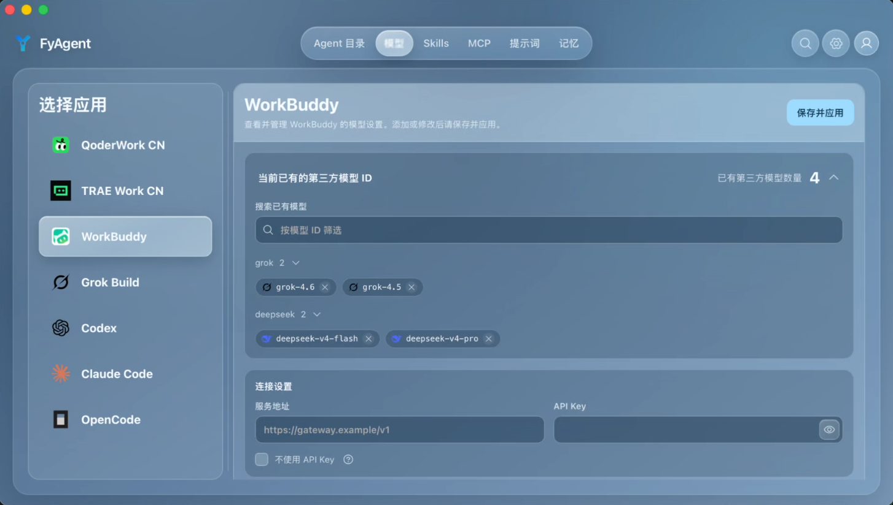
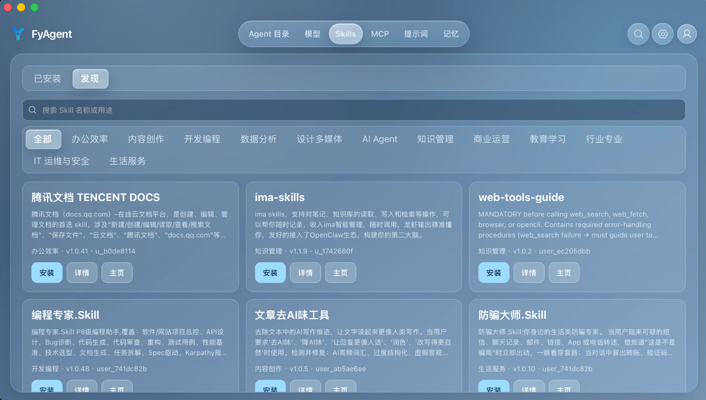
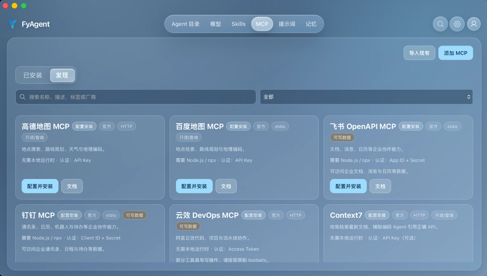

<div align="center">
  
  <h1>FyAgent</h1>
  <p><strong>Own your AI.</strong></p>
  <p>A personal desktop control center that keeps you in charge of the AI Workers and Agents you use.</p>
  <p><a href="README.md">简体中文</a> · <a href="README_JA.md">日本語</a></p>
  <p>
    <a href="https://github.com/fy-agent/fyagent/releases/latest"></a>
    <a href="https://github.com/fy-agent/fyagent/actions/workflows/ci.yml"></a>
    
    <a href="LICENSING.md"></a>
  </p>
  <p>
    <a href="https://github.com/fy-agent/fyagent/releases/latest"><strong>Download</strong></a> ·
    <a href="docs/user-manual/en/README.md">Manual</a> ·
    <a href="https://github.com/fy-agent/fyagent/discussions">Discussions</a> ·
    <a href="CONTRIBUTING.md">Contribute</a>
  </p>
</div>

## A personal control center for the AI era

FyAgent is for people who use AI Agents, AI Workers, and assistants. It brings the choices that shape an AI—where its models come from, which tools it can reach, what skills it has, which instructions it follows, and how it is configured—into one local desktop app.

You do not need to begin with terms such as Provider, MCP, or Prompt. To a person using the product, they are an AI's source of intelligence, its tool connections, and its working instructions. FyAgent makes those choices visible, editable, and easier to carry between tools.

Today, FyAgent starts with the most concrete configuration layer and supports Claude Code, Claude Desktop, Codex, Gemini CLI, Grok Build, OpenCode, OpenClaw, and Hermes.

WorkBuddy has a separate top-level configuration entry. It is not part of the target-tool or Provider domains above, so its scope should not be inferred from that tool list.

> **Release status:** FyAgent is under active development. Back up important configuration before upgrading, and review the trust information for each release before installing it.

## Interface

The current desktop UI, captured in Simplified Chinese. The top bar switches among Agent directory, Models, Skills, MCP, Prompts, and Memory.

<table>
  <tr>
    <td align="center" width="50%">
      
      <br><em>Models</em>
    </td>
    <td align="center" width="50%">
      
      <br><em>Skills</em>
    </td>
  </tr>
  <tr>
    <td align="center" colspan="2">
      
      <br><em>MCP</em>
    </td>
  </tr>
</table>

## Vision: a portable digital persona for the AI era

A “digital persona” is not an avatar that imitates how you speak. It is the durable expression of how you choose, shape, and manage AI: which models it uses, what it can connect to, which skills it has, how it should work, and what it should remember.

- **Vision:** become a portable digital persona for everyone in the AI era.
- **Mission:** make powerful AI controllable, trustworthy, and able to stay with you.
- **Product role:** be the steering wheel for your AI, so its sources of capability, behavior, connections, and ownership remain clear.

As AI becomes more capable, people have more reasons to worry about permissions, fragile configuration, and starting over whenever they change tools. FyAgent keeps those choices on the human side. The goal is not to hand everyone the same bot, but to help each person gradually own, shape, and manage their AI.

Long-term memory and a durable cross-tool persona are part of the product direction. The section below lists what the current release provides today.

## What FyAgent can do today

| Human-facing capability | Current feature                                                                              |
| ----------------------- | -------------------------------------------------------------------------------------------- |
| AI brain                | Manage providers and model choices, using built-in presets or compatible custom endpoints    |
| Tool connections        | Maintain MCP servers centrally and sync them to supported AI tools                           |
| AI skills               | Manage Skills without repeating the same setup in every tool                                 |
| Working instructions    | Reuse Prompts that carry familiar ways of working between tools                              |
| Routing and recovery    | Forward requests through the local proxy, define failover rules, and test model availability |
| Usage record            | Review token usage and estimated cost in one view                                            |
| Work continuity         | Resume sessions and workspaces, then back up and sync configuration                          |

Working data is stored locally in `~/.fyagent` by default. FyAgent uses SQLite and atomic file writes for configuration updates; `fyagent://` imports show the proposed changes before anything is written.

## Architecture

The `React/Vite` renderer calls Rust commands and services through Tauri IPC. The local Rust layer owns SQLite state, configuration writes for target AI tools, and the local proxy. See the maintained [development guide](docs/fyagent/development/README.md) for layer ownership and validation boundaries.

## Quick start

1. Download the build for your platform from [GitHub Releases](https://github.com/fy-agent/fyagent/releases/latest).
2. Open **Providers** and add the service you use. A preset fills in the common fields.
3. Select the provider and choose **Apply**, then review the configuration FyAgent will write.
4. Send a small test request from the target AI tool. Add tool connections, Skills, or working instructions after the basic path works.

See the full [English manual](docs/user-manual/en/README.md), or switch to [简体中文](docs/user-manual/zh/README.md) or [日本語](docs/user-manual/ja/README.md).

## Downloads and release trust

Release files follow these names:

- macOS: `FyAgent-X.Y.Z-macOS.dmg`
- Windows: `FyAgent-X.Y.Z-Windows-x64-setup.exe`, `FyAgent-X.Y.Z-Windows-arm64-setup.exe`

Windows releases use an NSIS setup program; MSI and portable ZIP packages are not part of the current release surface. macOS builds are signed with an Apple Developer ID and notarized.

Before installing, read the release notes and verify the published checksums, `signing-status.json`, and build attestation. `NotSigned` is a status, not proof that a file is safe. See the [installation guide](docs/user-manual/en/1-getting-started/1.2-installation.md) for platform-specific steps and the [release notes index](docs/release-notes/README.md) for version history.

## FAQ

<details>
<summary><strong>Where does FyAgent store its data?</strong></summary>

FyAgent uses `~/.fyagent` on the local device by default. See [Configuration files](docs/user-manual/en/6-faq/6.1-config-files.md) for exact locations and backup guidance.

</details>

<details>
<summary><strong>Where should I ask for installation or configuration help?</strong></summary>

Check the [FAQ manual](docs/user-manual/en/6-faq/6.2-questions.md), then open a [Q&A discussion](https://github.com/fy-agent/fyagent/discussions/categories/q-a) with your FyAgent version, operating system, related tool, and what you have already tried. Use the [Bug Report](https://github.com/fy-agent/fyagent/issues/new?template=bug_report.yml) form for a reproducible software defect.

</details>

<details>
<summary><strong>Does FyAgent already provide long-term memory and a complete digital persona?</strong></summary>

Not yet. The current release focuses on unified management of models, tool connections, Skills, working instructions, configuration, and usage records. Long-term memory and a persona that persists across tools remain a product direction until the corresponding features are implemented and verified.

</details>

<details>
<summary><strong>Is FyAgent open source?</strong></summary>

FyAgent is source-available, not open source as defined by the OSI. FyAgent-owned components and modifications use PolyForm Noncommercial License 1.0.0; CC Switch-derived portions remain under the MIT License. See [Licensing](LICENSING.md).

</details>

## Join the community

- Usage questions and troubleshooting: [Q&A](https://github.com/fy-agent/fyagent/discussions/categories/q-a)
- Early product ideas: [Ideas](https://github.com/fy-agent/fyagent/discussions/categories/ideas)
- Share your AI setup and way of working: [Show and tell](https://github.com/fy-agent/fyagent/discussions/categories/show-and-tell)
- Reproducible defects and scoped work: [Issues](https://github.com/fy-agent/fyagent/issues)

See [CODE_OF_CONDUCT.md](CODE_OF_CONDUCT.md), [SUPPORT.md](SUPPORT.md), and [CONTRIBUTING.md](CONTRIBUTING.md) for community expectations and contribution paths.

## Development

A first checkout requires a global `mise >= 2026.8.6`. After reviewing the repository configuration, use this sequence for interactive development:

```bash
mise trust
mise run bootstrap
mise run system:check
mise run dev
```

A current-host build is optional and separate from interactive startup:

```bash
mise run build
```

Validation evidence is scoped deliberately:

- `mise run check` is the complete current-host gate. It does not prove native-window or installer HIL, signing, or notarization.
- A successful `CI / Required` result on the exact pull-request head is the remote merge gate; another SHA or an individual component job is not a substitute.
- A formal Release requires its separate exact-source-SHA, prerequisite CI, annotated-tag, formal Release workflow, and published-asset evidence chain. A local build or pull-request check does not establish that chain.

The [development guide](docs/fyagent/development/README.md) lists the toolchain and smaller checks available while you work.

## Project history and license

FyAgent began as VibeKey, an idea for putting AI configuration and controls into a physical keyboard that people could carry. As the project developed, it became clear that the important thing to carry was not a piece of hardware, but each person's own AI choices, habits, and way of working. The product moved to cross-platform desktop software and became **FyAgent—For You Agent**.

The current desktop app evolved from CC Switch and retains upstream copyright and license notices for inherited code. The FyAgent product name, current development, and FyAgent-owned additions are maintained by the FyAgent project.

FyAgent-owned components and modifications use the [PolyForm Noncommercial License 1.0.0](LICENSES/PolyForm-Noncommercial-1.0.0.txt); commercial use requires separate written authorization. See [LICENSE](LICENSE), [LICENSING.md](LICENSING.md), and [THIRD_PARTY_NOTICES.md](THIRD_PARTY_NOTICES.md).
