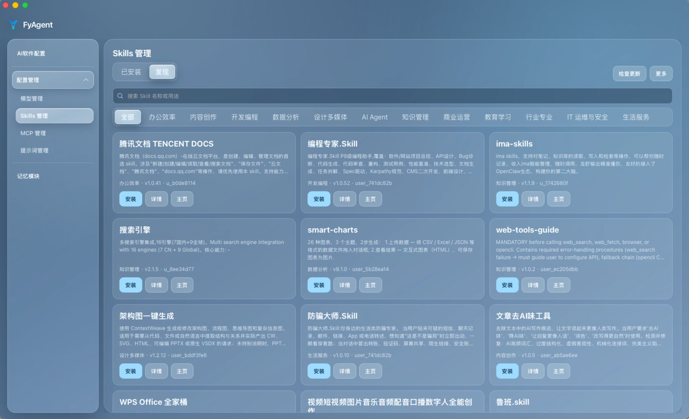
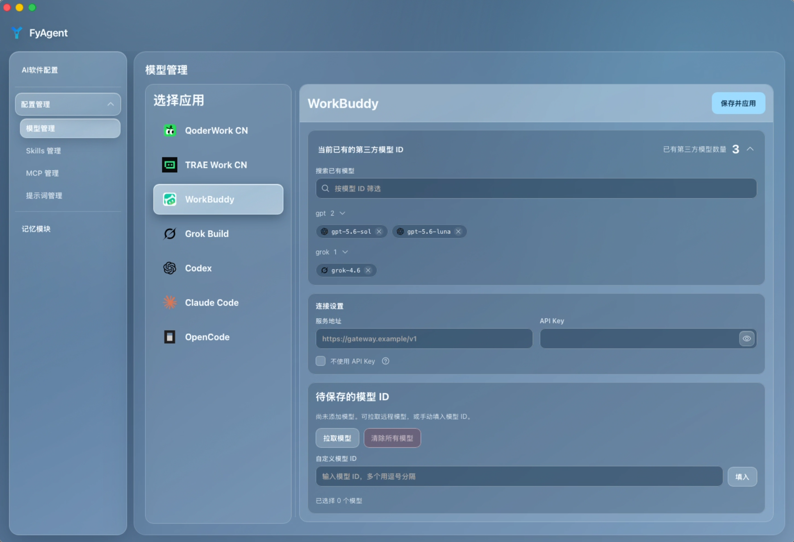
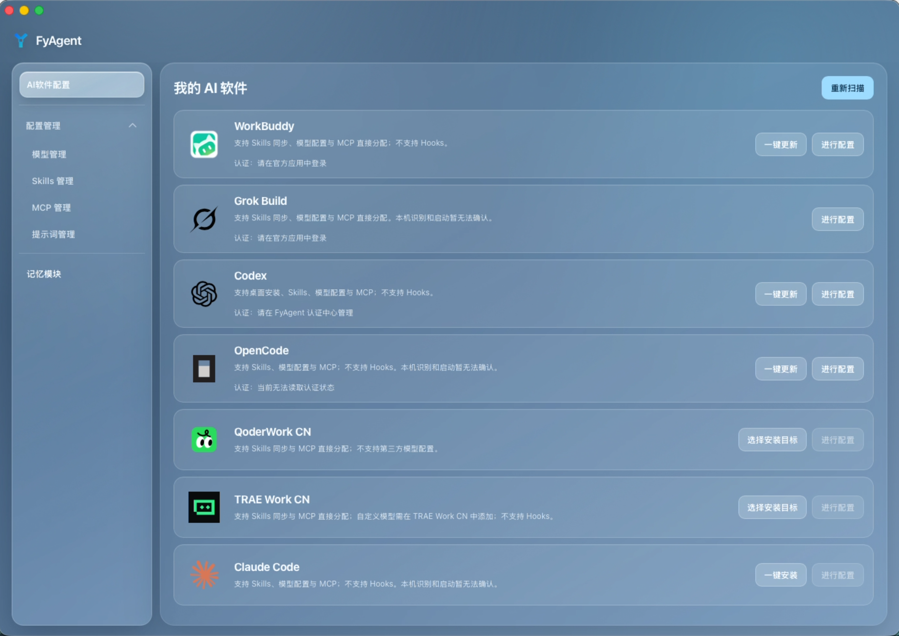

<div align="center">
  
  <h1>FyAgent</h1>
  <p><strong>自分の AI を、自分のものに。</strong></p>
  <p>AI Worker と AI Agent を自分で管理するための、パーソナル・デスクトップコントロールセンター。</p>
  <p><a href="README_EN.md">English</a> · <a href="README.md">简体中文</a></p>
  <p>
    <a href="https://github.com/fy-agent/fyagent/releases/latest"></a>
    <a href="https://github.com/fy-agent/fyagent/actions/workflows/ci.yml"></a>
    
    <a href="LICENSING.md"></a>
  </p>
  <p>
    <a href="https://github.com/fy-agent/fyagent/releases/latest"><strong>ダウンロード</strong></a> ·
    <a href="docs/user-manual/ja/README.md">マニュアル</a> ·
    <a href="https://github.com/fy-agent/fyagent/discussions">Discussions</a> ·
    <a href="CONTRIBUTING.md">コントリビュート</a>
  </p>
</div>

## AI 時代のパーソナルコントロールセンター

FyAgent は、AI Agent、AI Worker、AI アシスタントを利用する人のためのアプリです。モデルの入手先、接続できるツール、利用するスキル、従う指示、各種設定といった AI を形づくる選択を、ローカルのデスクトップアプリにまとめます。

Provider、MCP、Prompt といった用語を先に理解する必要はありません。利用者にとっては、AI の知能の供給元、ツールとの接続、仕事の指示に当たります。FyAgent は、分散して見えにくかった選択を、確認・変更しやすい形にします。

> **リリース状況:** FyAgent は現在も継続的に開発されています。更新前に大切な設定をバックアップし、インストール前に各リリースの信頼情報を確認してください。

## 現在の機能

| 画面                | できること                                                                                                                                                             |
| ------------------- | ---------------------------------------------------------------------------------------------------------------------------------------------------------------------- |
| AI ソフトウェア設定 | QoderWork CN、TRAE Work CN、WorkBuddy、Grok Build、Codex、Claude Code、OpenCode をスキャンし、対応している場合はインストール、更新、起動、認証、リソース割り当てを行う |
| モデル管理          | 上記アプリのモデルと Provider 設定を確認・変更し、書き込み前のプレビューと保存後の結果を確認する                                                                       |
| Skills 管理         | ローカルファイルまたは検索結果から Skills をインストールし、対応アプリへ割り当てる                                                                                     |
| MCP 管理            | MCP サーバーを追加・インポート・管理し、対応アプリへ割り当てる                                                                                                         |
| プロンプト管理      | Grok Build、Codex、Claude Code、OpenCode、Gemini、OpenClaw、Hermes のプロンプトを管理する                                                                              |
| メモリーモジュール  | OpenClaw と Hermes の長期メモリー、および OpenClaw のデイリーメモリーを編集する                                                                                        |

作業データは既定で `~/.fyagent` に保存されます。正確な保存場所、バックアップ方法、アプリごとの制限は[マニュアル](docs/user-manual/ja/README.md)を参照してください。

## 画面

以下は簡体字中国語の画面です。左側のナビゲーションから、AI ソフトウェア設定、モデル、Skills、MCP、プロンプト、メモリーを開きます。

<table>
  <tr>
    <td align="center" width="50%">
      
      <br><em>Skills</em>
    </td>
    <td align="center" width="50%">
      
      <br><em>モデル管理</em>
    </td>
  </tr>
  <tr>
    <td align="center" colspan="2">
      
      <br><em>AI ソフトウェア設定</em>
    </td>
  </tr>
</table>

## クイックスタート

1. [GitHub Releases](https://github.com/fy-agent/fyagent/releases/latest) から、お使いの環境に合うファイルをダウンロードします。
2. 「AI ソフトウェア設定」を開き、端末にインストールされているアプリをスキャンします。
3. アプリを選んで設定画面を開きます。表示されている項目から、モデル、Skills、MCP、プロンプト、認証を設定します。
4. 保存前に変更対象を確認します。保存後は画面の案内に従って結果を確認するか、接続をテストします。

詳しい手順は[日本語マニュアル](docs/user-manual/ja/README.md)にあります。[English](docs/user-manual/en/README.md) と [简体中文](docs/user-manual/zh/README.md) も利用できます。

## ダウンロードとリリース検証

ファイル名は次の形式です。

- macOS: `FyAgent-X.Y.Z-macOS.dmg`
- Windows: `FyAgent-X.Y.Z-Windows-x64-setup.exe`、`FyAgent-X.Y.Z-Windows-arm64-setup.exe`

Windows 版は NSIS セットアップを使用し、MSI とポータブル ZIP は現在提供していません。macOS 版は Apple Developer ID で署名され、公証を受けています。

インストール前にリリースノートを読み、公開されたチェックサム、`signing-status.json`、ビルド証明を確認してください。`NotSigned` は署名状態を示すもので、ファイルの安全性を証明するものではありません。各 OS の手順は[インストールガイド](docs/user-manual/ja/1-getting-started/1.2-installation.md)、変更履歴は[リリースノート一覧](docs/release-notes/README.md)を参照してください。

## よくある質問

<details>
<summary><strong>FyAgent のデータはどこに保存されますか？</strong></summary>

既定ではローカル端末の `~/.fyagent` に保存されます。正確な場所とバックアップ方法は[設定ファイル](docs/user-manual/ja/6-faq/6.1-config-files.md)をご覧ください。

</details>

<details>
<summary><strong>インストールや設定について、どこで質問できますか？</strong></summary>

[FAQ マニュアル](docs/user-manual/ja/6-faq/6.2-questions.md)を確認したうえで、FyAgent のバージョン、OS、関連アプリ、試した内容を [Q&A](https://github.com/fy-agent/fyagent/discussions/categories/q-a) に投稿してください。再現可能な不具合は [Bug Report](https://github.com/fy-agent/fyagent/issues/new?template=bug_report.yml) を利用してください。

</details>

<details>
<summary><strong>FyAgent はオープンソースですか？</strong></summary>

FyAgent はソースを利用可能なソフトウェアであり、OSI が定義するオープンソースではありません。FyAgent 独自のコンポーネントと変更部分には PolyForm Noncommercial License 1.0.0、CC Switch 由来の部分には MIT ライセンスが適用されます。詳しくは[ライセンス説明](LICENSING.md)をご覧ください。

</details>

## コミュニティと貢献

- 使い方とトラブルシューティング：[Q&A](https://github.com/fy-agent/fyagent/discussions/categories/q-a)
- 機能の提案：[Ideas](https://github.com/fy-agent/fyagent/discussions/categories/ideas)
- 設定や使い方の共有：[Show and tell](https://github.com/fy-agent/fyagent/discussions/categories/show-and-tell)
- 再現可能な不具合と具体的な作業：[Issues](https://github.com/fy-agent/fyagent/issues)

コミュニティの行動規範、サポート範囲、貢献方法は [CODE_OF_CONDUCT.md](CODE_OF_CONDUCT.md)、[SUPPORT.md](SUPPORT.md)、[CONTRIBUTING.md](CONTRIBUTING.md) をご覧ください。

## ローカル開発

初回 checkout には、グローバルにインストールした `mise >= 2026.8.6` が必要です。

```bash
mise trust
mise run bootstrap
mise run system:check
mise run dev
```

現在のシステム向けにビルドします。

```bash
mise run build
```

変更を提出する前に `mise run check` を実行してください。ツールチェーン、個別チェック、リリース要件は[開発ガイド](docs/fyagent/development/README.md)にあります。

## プロジェクトの由来とライセンス

FyAgent の前身 VibeKey は、物理キーボードとドライバーの製品構想でした。その後、AI アプリの設定とローカルデータ管理に重点を置くクロスプラットフォームのデスクトップソフトウェアへ移行し、**FyAgent（For You Agent）** に改名しました。

現在のデスクトップアプリは CC Switch を基に発展し、継承したコードの著作権表示とライセンスを維持しています。FyAgent 独自のコンポーネントと変更部分には [PolyForm Noncommercial License 1.0.0](LICENSES/PolyForm-Noncommercial-1.0.0.txt) が適用され、商用利用には別途書面による許可が必要です。詳しくは [LICENSE](LICENSE)、[LICENSING.md](LICENSING.md)、[THIRD_PARTY_NOTICES.md](THIRD_PARTY_NOTICES.md) を参照してください。
