# FyAgent 前端交互重构 v3｜高保真原型评审包

> 日期：2026-08-25  
> 状态：`APPROVED_FOR_IMPLEMENTATION_2026-08-26`  
> 本材料是设计评审依据，不是实现完成或上线证明。

## 1. 为什么做这轮改动

FyAgent 当前版本已经形成稳定的蓝色 liquid-glass 主题，本轮并不重新定义品牌色或视觉风格。产品经理通过线框原型重排了按钮、入口和页面层级，目标是让用户更快分清两类动作：

1. 在某个 Agent 内选择它要使用的模型、Skills、MCP 和提示词。
2. 在全局管理页维护这些资源，并决定它们分配给哪些 Agent。

讨论原文与 10 页线框共同构成本轮事实基线。高保真原型在保留现有主题的前提下，把线框中的信息架构、按钮位置、返回路径和状态反馈落成一套连续页面。

## 2. 已确认的产品方案

- 左侧主导航固定为 `AI软件配置 / 配置管理 / 记忆模块`。
- `AI软件配置` 负责发现软件和进入单个 Agent 的选配页。
- Agent 内部固定使用 `模型 / Skills / MCP / 提示词` 四段切换。
- 每个 Agent 选配页提供搜索、启停或选择，以及进入对应全局管理页的入口。
- `配置管理` 展开为 `模型管理 / Skills 管理 / MCP 管理 / 提示词管理`。
- 全局管理页统一采用“资源列表—详情—应用分配”的结构。
- `记忆模块` 延续现有长期记忆/每日记忆能力，只统一到新导航壳层。
- 线框第 5 页误写的“进入 Skills 管理”已纠正为“进入提示词管理”。
- 原型内的 API Key 只显示掩码；记忆内容使用安全示例，不展示真实个人信息或密钥。

## 3. 高保真页面

### 01｜AI 软件扫描完成

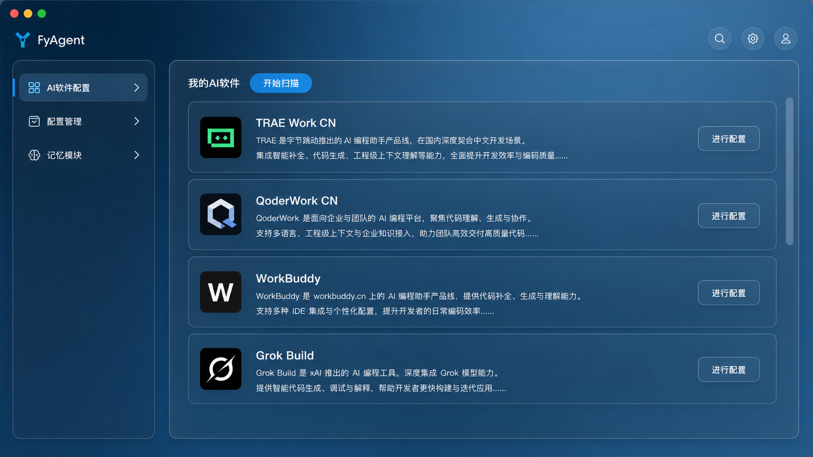

确认点：软件发现完成后的列表层级、每行“配置”入口、重新扫描和扫描结果反馈。

### 02｜AI 软件扫描中

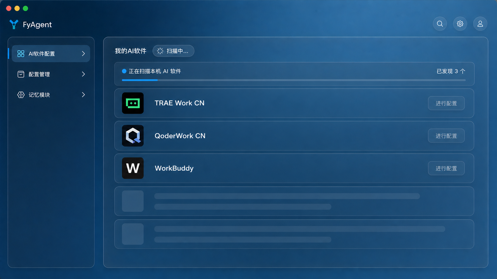

确认点：扫描进行中的进度感、禁用态与用户是否清楚下一步需要等待。

### 03｜Agent 模型选配

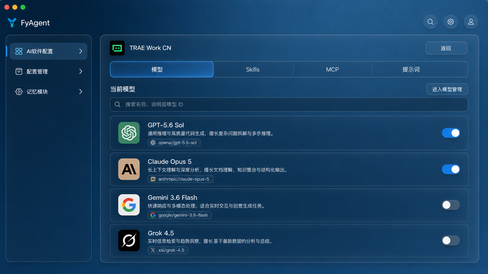

确认点：四段页签、模型选择、已选状态、返回按钮和“进入模型管理”。

### 04｜Agent Skills 选配

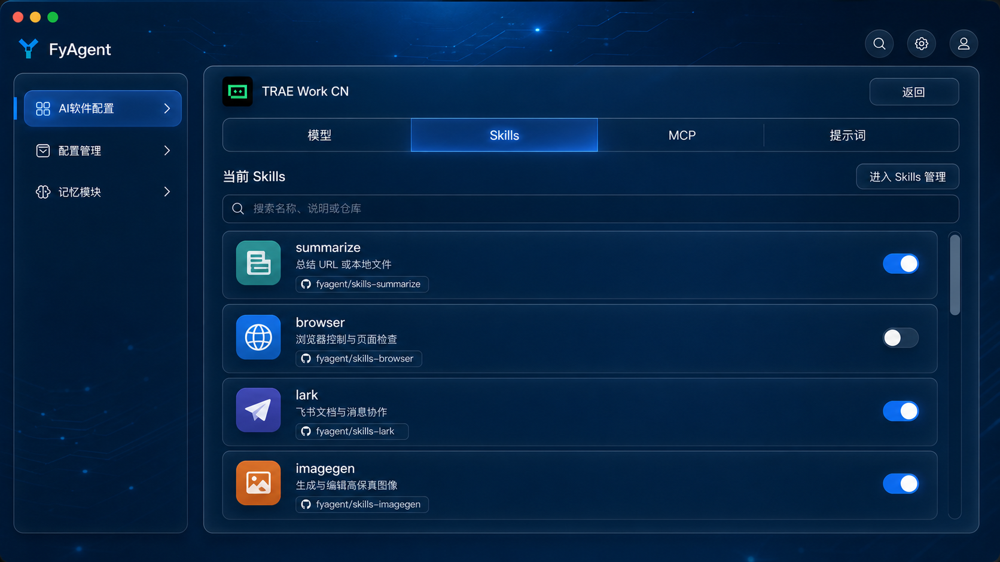

确认点：搜索、单项开关、来源信息和“进入 Skills 管理”。

### 05｜Agent MCP 选配

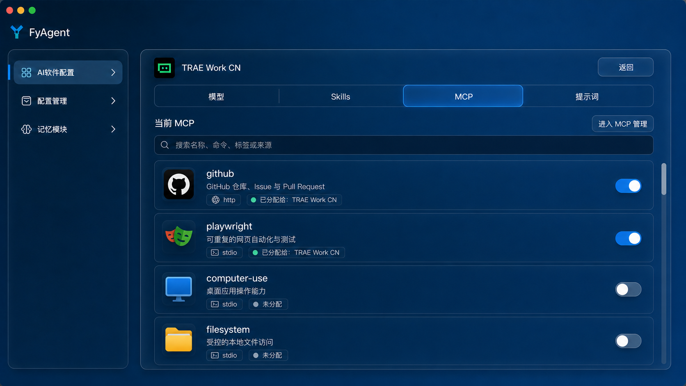

确认点：transport/source 信息、分配状态、单项开关和“进入 MCP 管理”。

### 06｜Agent 提示词选配

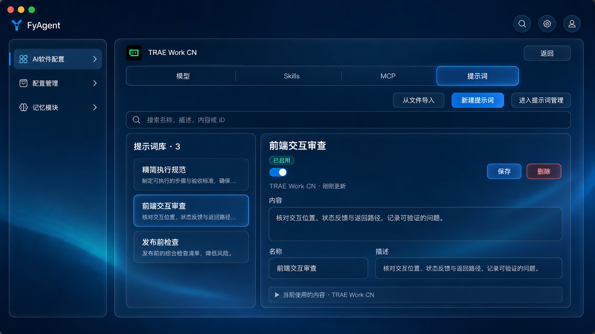

确认点：提示词库与编辑器共存、导入/新建/保存/删除，以及“进入提示词管理”。

### 07｜模型管理

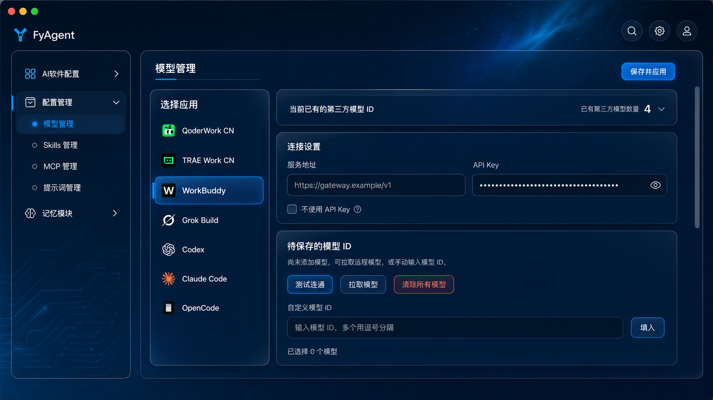

确认点：按应用管理连接设置、API Key 掩码、测试连通、拉取模型与保存并应用。

### 08｜Skills 管理

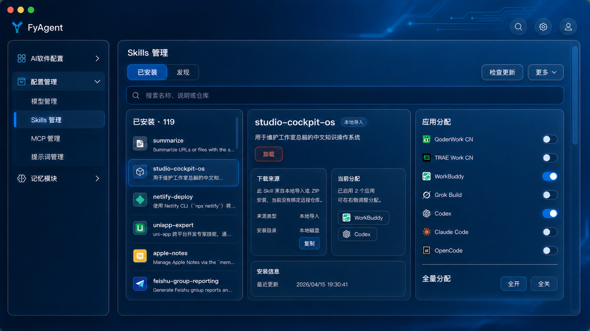

确认点：已安装/发现、资源详情、安装来源、应用分配与全开/全关。

### 09｜MCP 管理

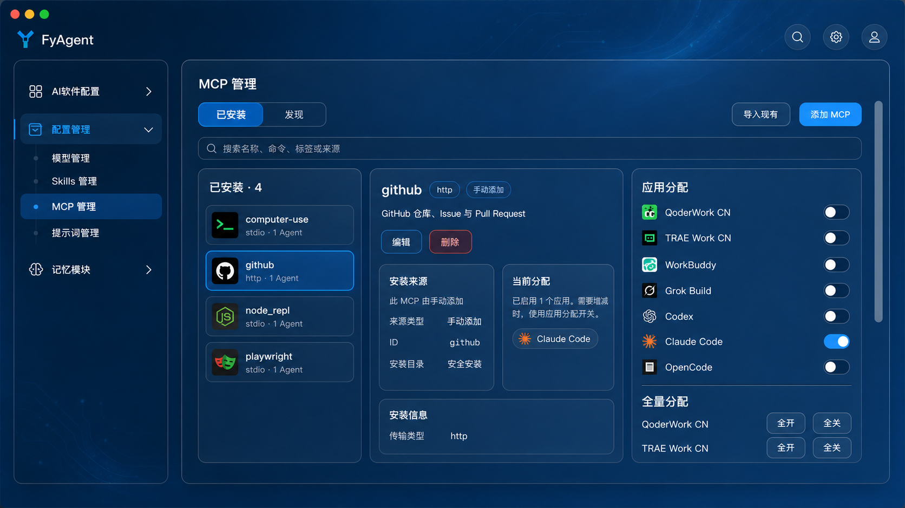

确认点：导入现有/添加 MCP、编辑/删除、transport 信息与应用分配。

### 10｜提示词管理

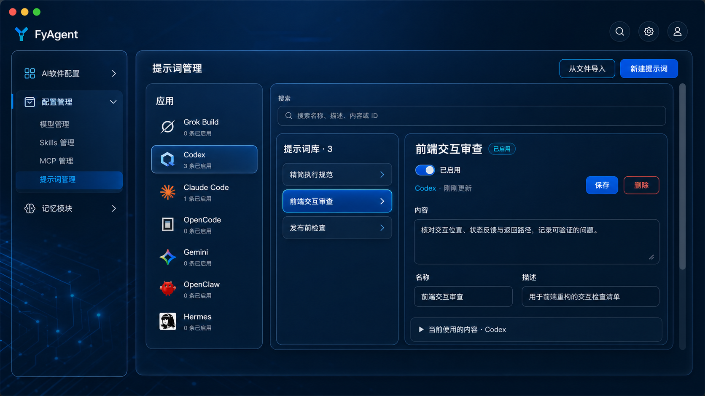

确认点：应用维度筛选、提示词库、编辑器、启用状态和保存/删除。

### 11｜记忆模块

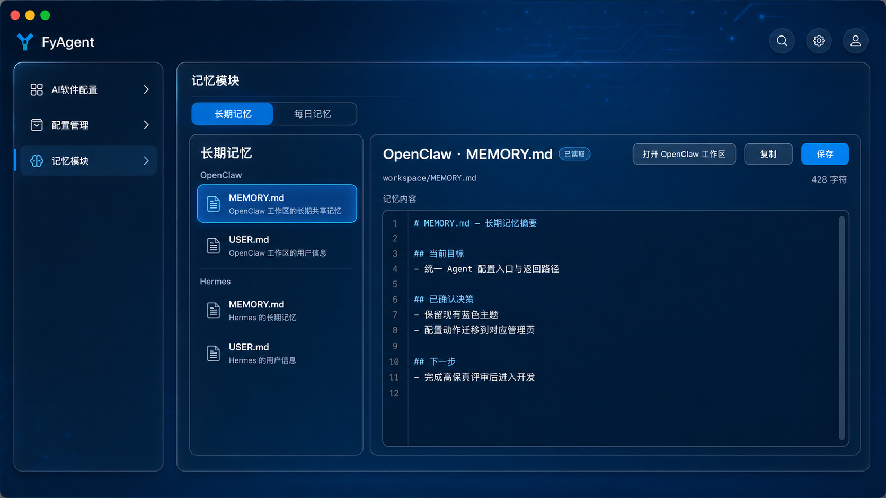

确认点：长期记忆/每日记忆、Agent/文件选择、复制/保存/打开工作区和编辑区域。

## 4. 评审结论

人类已确认 11 张页面可以进入开发。后续反馈转入运行态缺陷流程，并继续按页面编号分级：

- `必须改`：信息架构、入口位置、动作缺失、状态逻辑或明显文案问题。
- `建议改`：密度、层级、强调程度、尺寸或视觉细节。
- `可进入开发`：当前结论，设计层 Blocking 已清零。

推荐格式：

```text
页面：08 Skills 管理
级别：必须改 / 建议改
位置：右侧应用分配
问题：……
期望：……
```

## 5. 已批准的执行顺序

1. 冻结 11 张图和交互决策，形成开发基线。
2. 盘点现有前端路由、导航壳层、页面状态和可复用组件。
3. 将工作拆给 Grok、Gemini、Codex，并由 Codex 负责最终整合与证据口径。
4. 先实现稳定壳层与返回路径，再实现各资源页和状态覆盖。
5. 依次完成代码检查、构建、运行态截图和关键状态交互测试。
6. 若要求严格 1:1，再补像素对比；没有运行态证据前不宣称页面验收通过。

## 6. 当前交付边界

- `design_approved`：11 张高保真图与本评审包，已获人类批准。
- `code_audit`：已完成规划级差距盘点；尚未产生实现通过结论。
- `runtime_screenshot`：尚未开始。
- `pixel_diff`：尚未开始。
- `merge / release / production`：均未发生。
