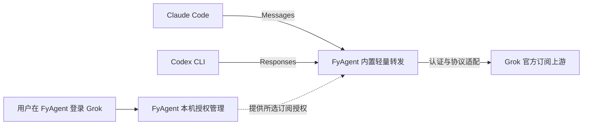
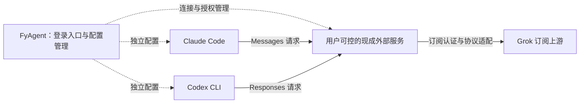

# 订阅账号跨 Agent 使用：产品技术方案与可行性复核

> 2026-09-08 实施更新：本次采用 FyAgent 内置本机转发，支持 Grok 订阅兼容接入 Claude Code 和 Codex CLI。当前方案与证据见同名 Trellis 任务，完成后归档至 `.trellis/tasks/archive/2026-09/08-31-grok-first-class-iteration/`。下文保留此前选型阶段的调查，不作为本次已测试或已交付清单。

本次实现复用现有 Managed Auth 登录、vault 和令牌刷新 owner，不复制上游令牌到目标 Agent。Claude Code 应用后启动本机连接；Codex 先保存来源，再通过现有预览和确认流程应用。失败补偿和退出恢复沿用现有配置 owner，Codex 自身登录文件的当前内容保持独立。

上游遵循 [官方 Grok CLI 固定版本说明](https://github.com/xai-org/grok-build/blob/72a61251fcffb464bcc687aeb5a998e5a98ec0c9/crates/codegen/xai-grok-shell/README.md#using-authjson-for-api-access)：`cli-chat-proxy.grok.com/v1/chat/completions`、CLI 会话认证头和所选模型的路由头。Claude Messages 与 Codex Responses 在本机转换。普通 API key 来源仍使用自己的 API 入口。页面将此能力标为实验性，模型选项仅是官方文档建议，实际可用性与额度使用必须由账号及上游返回确认。

当前不展示 Claude Desktop 或 WorkBuddy 的订阅投放入口；WorkBuddy 的既有 API 配置流程保留。不安装 Docker、不部署云端服务、不引入新的系统账号或跨设备同步。

日期：2026-09-08。评估人：Codex。

本文用于后续需求和架构讨论。本轮只读取资料、核对源码并编写方案，没有改产品代码，没有部署服务，没有进行登录、请求或额度测试。FyAgent 已安装版本是 0.4.4。

最新产品约束：FyAgent 面向小白用户，以单台设备为使用边界，没有 FyAgent 云账号、云服务器或跨设备同步需求。**当前推荐采用 FyAgent 已有的内置轻量转发，补齐一次登录、逐目标应用和后台生命周期。** CLIProxyAPI 仅作出现明确兼容或维护阻碍时的替代候选。外部平台、远端连接与 Docker 部署从当前需求中移出，旧调研保留在比较文档和本文附录，不进入实施清单。

## 1. 现有方案在哪里

原案确实存在，不需要重新发明需求。它位于 PR #172 的 `feat/grok-first-class-iteration` 分支，核对版本为 `b8b15dbaf141f7c7fbd7816914fda59a07a2208a`。本机主工作目录仍保留旧开发分支和未提交内容，所以不能用当前目录有没有这些文件判断原案是否存在。

| 原材料                                                                                                                                                                  | 内容                                                                                             | 本次判断                                                          |
| ----------------------------------------------------------------------------------------------------------------------------------------------------------------------- | ------------------------------------------------------------------------------------------------ | ----------------------------------------------------------------- |
| [产品需求 prd.md](https://github.com/fy-agent/fyagent/blob/b8b15dbaf141f7c7fbd7816914fda59a07a2208a/.trellis/tasks/08-31-grok-first-class-iteration/prd.md)             | SuperGrok 登录一次，分别用于 Claude Code、Claude Desktop、Codex、WorkBuddy；逐目标保存，双机体验 | 目标、范围和验收方向明确，可以保留                                |
| [技术设计 design.md](https://github.com/fy-agent/fyagent/blob/b8b15dbaf141f7c7fbd7816914fda59a07a2208a/.trellis/tasks/08-31-grok-first-class-iteration/design.md)       | 复用旧认证中心和 xAI Provider，接通新版 Codex 配置应用，WorkBuddy 走自己的保存路径               | 是既有实现的接线方案；没有完成外部方案选型与部署设计              |
| [实施计划 implement.md](https://github.com/fy-agent/fyagent/blob/b8b15dbaf141f7c7fbd7816914fda59a07a2208a/.trellis/tasks/08-31-grok-first-class-iteration/implement.md) | 登录入口、Claude/Codex 投放、WorkBuddy 投放、最后双机体验                                        | 任务分解存在；原案 `task.json` 仍为 `planning`，不能视为已经验收  |
| [Discussion #106](https://github.com/fy-agent/fyagent/discussions/106)                                                                                                  | 一个账号、多处使用、不额外购买 xAI API Key；对照 CC Switch 既有实现                              | 产品意图来源；提到官方原生直连，但没有证明异种 CLI 都能无转换直连 |
| [Issue #42](https://github.com/fy-agent/fyagent/issues/42)、[PR #172](https://github.com/fy-agent/fyagent/pull/172)                                                     | 同一来源投给多个 Agent；每个目标独立预览、保存、回读                                             | 均未关闭/合并；8 月 31 日后续决定已覆盖早期“只做 Codex”的范围     |

另外，0.4.4 的 [Managed Auth 规范](https://github.com/fy-agent/fyagent/blob/2f264d2f89326601a33f610c72a9f0143306d066/.trellis/spec/backend/managed-auth.md) 和 [consumer 规范](https://github.com/fy-agent/fyagent/blob/2f264d2f89326601a33f610c72a9f0143306d066/.trellis/spec/backend/managed-auth-consumers.md) 是认证实现约束，不能代替上面的跨 Agent 产品方案。

网页版 GPT 原始对话尚未定位。已检查可见任务记录及浏览器入口，未取得可验证的对应聊天；不能据此断言那段讨论不存在，也不能把本次查到的外部项目冒认成当时选定的方案。

## 2. 原案成熟度判断

**产品目标已成形，本轮已收敛为单机内置转发；登录到实际调用的产品闭环仍需实施验证。** 原案缺口和本次处理如下。

1. **原案没有比较实现路线。** 本次已完成比较，并根据单机、小白用户的约束选择现有内置转发。这个选择基于已有实现和产品复杂度，尚不是性能实测胜出的结论。
2. **登录和调用之间还缺契约。** “同一把钥匙给几家共用”没有定义目标协议、实际上游、刷新责任和额度归属。共享一个订阅来源不等于复制同一份 refresh token。
3. **部分实现描述已过时。** 原案写到 `xai_oauth_auth.json`；0.4.4 已有 Managed Auth / SecretRef、credential purpose 和刷新所有权。后续开发必须按新认证模型适配，不能照旧文件描述实施。
4. **目标支持程度不同。** WorkBuddy 一节仍把“地址和钥匙如何对应订阅账号”留为未解决问题；原生 Grok 登录、Claude API 协议、Codex Responses 协议不能合并成一个“已登录”状态。
5. **验收缺少实际请求归属。** 配置保存与回读只能证明文件改了。完整目标还要证明目标 CLI 确实走所选 Grok 账号、刷新后仍可用、没有静默切到另一个账号或 API 计费来源。本轮按要求不执行这些测试。

## 3. 本次修订的产品目标与边界

用户已有一个具备相应额度的订阅账号，在 FyAgent 中发起一次连接，随后选择 Claude Code、Codex 等目标。各目标使用该来源提供的模型和额度；FyAgent 显示每个目标的连接结果、当前来源和重新登录入口。

本轮边界为：**一个本机应用管理当前设备的订阅连接，为本机选择的 Agent 提供模型入口。** 用户不需要注册 FyAgent 账号、租服务器、安装 Docker 或管理数据库。该需求不新增远端托管、账号同步、共享账号池、团队权限或云端用量系统，也不改动产品其他无关能力。

这里仍有“用户登录 Grok 的上游订阅身份”，由本机保存授权；设备边界不等于制造一个 Grok 身份，也不改变订阅额度的归属。本轮仍是方案工作，不包含实施、凭据迁移或真实订阅调用。

必须保留三个不同来源：

- Grok CLI 原生登录：属于 Grok CLI 自身的认证状态。
- Grok / SuperGrok 订阅来源：目标是复用订阅可用额度，须验证具体 entitlement 和上游路径。
- xAI API Key：属于另一种 API 接入与计费来源，不能拿它的成功代替订阅复用成功。

“直接把 Token 放进目录”作为具体实现手段逐目标判断，不作为产品验收目标。凭据 helper 只提供凭据；是否还需要接口转换，由目标 CLI 和上游协议决定。

## 4. 引擎与部署选型

**选择：收完 FyAgent 现有内置转发。** 0.4.4 已有本机 Managed Auth、xAI OAuth/刷新与 Claude/Codex 转发基础。当前先补齐新版逐目标应用与运行生命周期，无需先更换引擎。另接原生进程会引入发行打包、进程通信、凭据归属和版本协同工作，目前没有足够证据证明这些替换成本能换来必要收益。

只有在后续发现现有模块存在明确的协议能力缺口或不可接受的维护成本时，才重新评估 CLIProxyAPI。以下保留比较结果；外部平台不再是本期备选部署分支。

| 路线                            | 本次证据                                                                                 | 部署位置               | 结论                                                                               |
| ------------------------------- | ---------------------------------------------------------------------------------------- | ---------------------- | ---------------------------------------------------------------------------------- |
| 目标 CLI 原生配置 / 凭据 helper | 官方配置可以指定兼容 endpoint 和凭据入口；helper 本身不完成 xAI OAuth 登录与协议转换     | 原生直连或连接现有入口 | 已有 API endpoint 时有用；单独不足以证明 SuperGrok 订阅跨 CLI 复用                 |
| **FyAgent 内置转发**            | 0.4.4 已有认证和转发源码链路，新版逐目标应用有缺口                                       | 现有本机应用内         | **当前采用方向：补齐现有链路**                                                     |
| CLIProxyAPI `v7.2.154`          | 固定源码有 xAI 设备码授权、刷新、订阅上游、Responses executor 和协议转换体系             | 现成原生进程           | 技术替代储备；仅当现有实现出现明确阻碍时重新评估                                   |
| Wei-Shaw/sub2api `v0.1.176`     | 主项目固定 tag 已包含 Grok OAuth、Claude Messages、Responses、Chat Completions、管理接口 | 完整服务平台           | 超出当前产品需要，不实施                                                           |
| grok2api、Hermes、LiteLLM       | 补充材料与能力差异见比较文档                                                             | 依实现而定             | grok2api 是专用备选；Hermes 尚缺两目标完整证据；LiteLLM API Key 能力不等于订阅授权 |
| CC Switch                       | v3.18 发布材料明确描述 xAI 订阅用于 Claude/Codex 及相应转换；FyAgent 已有该上游谱系      | 其既有实现依赖本机路由 | 作为实现参考，避免仅换包装重复集成同一链路                                         |

来源：[Sub2API 固定版本说明](https://github.com/Wei-Shaw/sub2api/blob/v0.1.176/README.md)、[CLIProxyAPI 发布页](https://github.com/router-for-me/CLIProxyAPI/releases/tag/v7.2.154)、[CC Switch 3.18 发布说明](https://github.com/farion1231/cc-switch/blob/606e7bbe75db7f8285f7a3be006fac22b5d22796/docs/release-notes/v3.18.0-en.md)、[Claude Code 网关配置](https://docs.anthropic.com/en/docs/claude-code/llm-gateway)、[Codex 配置参考](https://developers.openai.com/codex/config-reference/)。

## 5. 当前本机方案

### 5.1 请求与授权结构

本机只保存授权、配置和必要状态；模型计算仍在 Grok 上游。请求从目标 Agent 经本机入口到上游，不经过 FyAgent 自建云服务器。该模式仍需联网访问模型供应商。

继续由 FyAgent 的 Managed Auth 统一持有和刷新订阅授权。多个 Agent 使用同一个已选订阅来源，各目标保存本机入口和目标访问凭据；上游 refresh token 不复制到各家 CLI 的原生登录文件。没有新增 FyAgent 用户注册、跨设备身份或服务端账号体系。

### 5.2 小白用户看到的流程

1. 在 FyAgent 点击“连接 Grok”，完成供应商登录。
2. 选择“用于 Claude Code”“用于 Codex”等已经支持的目标。
3. FyAgent 自动管理本机入口，完成各目标的配置保存并显示当前来源。
4. 授权失效时从同一入口重新登录；用户取消某个目标的连接时，恢复该目标由本次操作修改的配置。

普通流程不出现 Docker、服务器、数据库、端口或引擎项目名。界面区分“配置已应用”与实际调用结果；真实订阅可用性仍由后续运行证据确认。

### 5.3 现有模块的分工与需要补齐的内容

| 部分     | 复用与补齐                                                                                                           |
| -------- | -------------------------------------------------------------------------------------------------------------------- |
| 授权     | 复用 Managed Auth / SecretRef、刷新和脱敏状态；确保转发消费者引用当前有效授权，刷新责任唯一                          |
| 本机转发 | 复用现有 xAI 适配与 Claude/Codex 请求处理；绑定到所选订阅来源，仅监听环回地址并校验客户端访问凭据                    |
| 目标应用 | 复用已有 Provider 与 Change Plan 的适用能力；修通新版 Codex 对托管来源的应用阻断，逐目标预览、备份、保存、回读和恢复 |
| 状态     | 分清授权失效、转发未启动、目标配置未采用、模型不支持与上游限流；禁止静默切换其他账号、模型或 API Key 计费来源        |
| 生命周期 | 建立窗口关闭、托盘运行、彻底退出、重启和睡眠恢复的明确行为                                                           |

0.4.4 的新版 Codex 阻断见 [Change Plan 源码](https://github.com/fy-agent/fyagent/blob/2f264d2f89326601a33f610c72a9f0143306d066/src-tauri/src/services/change_plan/service.rs#L1610)。原生 Grok 凭据投放的开关见 [consumer 源码](https://github.com/fy-agent/fyagent/blob/2f264d2f89326601a33f610c72a9f0143306d066/src-tauri/src/services/managed_auth/consumers/grok.rs#L17)；它与多个目标共用本机转发入口是两种消费方式，不应为此直接取消凭据 purpose 隔离。

先覆盖 Claude Code 和 Codex；WorkBuddy、Claude Desktop、OpenCode 逐版本确认配置能力后另行接入。当前方案不据前两家的结果直接承诺其他目标已支持。

### 5.4 后台运行与资源约束

推荐首版沿用应用内服务：连接启用时运行，关闭主窗口后保留可见的托盘状态；用户选择彻底退出时停止服务，并明确说明依赖该入口的 Agent 随之暂停使用此来源。重新启动 FyAgent 后恢复已启用的本机入口。首次连接说明一次运行依赖，避免普通关闭窗口突然中断，也避免隐藏常驻服务。

不默认新增独立系统守护进程或开机常驻。若后续明确要求“彻底退出 FyAgent 后 CLI 仍可用”，再评估把现有模块拆成随应用交付的轻量本机服务；这一需求本身不要求 Docker，也不必更换协议引擎。

实现应限制缓冲、并发、重试与日志保留，避免空闲忙轮询；仅影响用户选定的 Agent 配置。资源测量另在实施阶段进行，不能用“没有 Docker”推导零资源占用。首版不新增独立数据库或缓存服务。

## 6. 后续实施与可行性验证

本轮只收敛方案，沿用用户“先不测试”的要求。后续实施顺序为：

1. 以 0.4.4 的 Managed Auth、转发与目标应用代码为基线，锁定实际开发版本，确认需要补齐的接口和目标配置契约。
2. 修通一个 Grok 订阅来源投给 Claude Code 与 Codex 的应用流程，保留配置备份、回读与恢复。
3. 补齐后台运行、彻底退出、重新启动、授权失效和睡眠恢复行为。
4. 进入验证阶段后，确认两家 CLI 的流式对话与工具调用确实使用所选订阅，刷新和并发不串号、不争抢令牌；再测量本机增量 CPU、内存、日志与唤醒。
5. 最后分别核对 macOS / Windows 的目标进程采用和恢复，不以文件保存替代实际使用。

第 4 步之前不称为订阅跨 CLI 已验证，第 5 步之前不称为双平台一键体验已交付。若出现明确协议缺口，再定点评估现成引擎；不先进行整套引擎替换。

## 7. 当前决策

**本机内置轻量转发是当前产品约束下最合适的采用方向，具体实现优先收完 FyAgent 现有模块。** 这项判断依赖单设备、小白用户、已有源码基础和无需服务器的定位；尚不等于经过性能对测证明的绝对最优。

产品体验收敛为“本机连接订阅，一次选择，多 Agent 使用”。当前不建设云账号、远端连接、跨设备同步、共享账号平台或 Docker 安装流程。CLIProxyAPI 的资料保留为替代储备，外部服务设计留档。本次只改方案，不改产品代码，不部署或调用真实账号。

## 附录 A：外部服务研究留档（当前不实施）

以下为此前方案比较的材料和技术草案，已被当前单机范围取代。保留来源是为避免丢失调研，不代表仍需开发或用户需要配置这些服务。

### A.1 Sub2API 的可复用能力与限制

本次确认的上游是 **`Wei-Shaw/sub2api`**，`v0.1.176` 的 tag object 为 `14e6d7ee7bdb1e4cb6bc59129a7ee1dd1110c52a`，指向 commit `e803e3851c0a7e222cfadeafad7b8636ab959d11`。检索曾命中 `YuHaiA/sub2api` 同名仓库；它的安装和克隆说明仍指向 Wei-Shaw。本案不以该分叉的 README 或 SHA 代替主项目版本证据。

该版本区分 Grok OAuth 订阅来源与 xAI API Key 来源；前者默认走 `cli-chat-proxy.grok.com`，后者走 `api.x.ai`。它提供 Claude Messages、OpenAI Responses 和 Chat Completions 接入，转换由服务承担。对于“已有订阅给多个 CLI 用”，这比单独提供 API key helper 更完整。[固定版本说明](https://github.com/Wei-Shaw/sub2api/blob/e803e3851c0a7e222cfadeafad7b8636ab959d11/README.md)

**一键登录存在权限与接口适配缺口。** 已有 Grok OAuth 接口属于管理员 API，普通推理 API key 不能使用。授权换码还会返回 token package，并非“只返回一个已保存的账号引用”。因此，不能仅配置服务地址就宣称 FyAgent 内登录已完成。[管理员路由](https://github.com/Wei-Shaw/sub2api/blob/e803e3851c0a7e222cfadeafad7b8636ab959d11/backend/internal/server/routes/admin.go)、[OAuth handler](https://github.com/Wei-Shaw/sub2api/blob/e803e3851c0a7e222cfadeafad7b8636ab959d11/backend/internal/handler/admin/grok_oauth_handler.go)

外置部署还需要服务器或 Docker、数据库、缓存、服务升级和网络可用性管理。适合接入已有服务或用户自管服务；本案不把建设一个共享公共中转平台纳入 FyAgent 桌面功能。代码许可按上游 [LICENSE](https://github.com/Wei-Shaw/sub2api/blob/v0.1.176/LICENSE) 的 LGPL-3.0-or-later 保留，开源实现不能替代供应商授权与实际账号可用性证据；这两项仍需在后续采用前核实。

### A.2 外置路线的可行性分级

- **已有外部服务 → 配置 Claude Code / Codex：源码与协议材料支持，条件可行。** 首先验证流式响应、工具调用和实际订阅归属。
- **FyAgent 内发起一次订阅登录 → 多目标配置：已有管理接口可复用，需要薄连接层。** 管理权限、授权回调、账号保存和推理 key 分发仍须实现。
- **面向普通用户的无管理员权限内嵌登录：尚未找到可直接复用的最小权限接口。** 可先走服务自己的登录页面；完整嵌入需要服务侧窄接口，不能下发全局管理员凭据。
- **完全不经过任何转换/路由服务：未证实。** 对特定单一目标可以继续验证原生直连，但不把它列为已解决的通用方案。

### A.3 外部服务连接器的历史设计

以下保存此前按外部服务方向编写的连接器设计。该分支已被最新单机产品约束排除，仅作为调研留档，不表示待开发任务或未来承诺。

模型请求从目标 CLI 发往外部服务，不经过 FyAgent 桌面进程。FyAgent 负责连接信息、登录发起、状态展示和逐目标配置；外部服务负责对应订阅的授权维护、接口适配与请求转发。关闭 FyAgent 后，已配置的目标仍应能使用外部来源；若现成服务没有这一能力，必须在选型结果中说明。

#### A.3.1 两种连接入口

**已有服务连接**：用户提供自己控制的服务地址与客户端访问凭据。FyAgent 识别协议和可用模型，展示来源，再为每个目标产生独立配置预览。这是接入现成 endpoint，不能描述成已经完成“在 FyAgent 登录订阅账号”。

**从 FyAgent 发起订阅连接**：用户先选择已连接的外部服务，FyAgent 通过该服务受支持的授权接口或授权页面发起登录。完成后绑定服务侧账号引用，再取得只用于目标 CLI 推理的访问凭据。只有在授权接口、状态关联、取消、过期和账号归属均有明确契约时，才将该入口开放为“一次登录”。如果现成项目只有管理网页，第一阶段可以打开该页面完成连接，但要如实说明，不能伪装为内嵌 OAuth 已完成。

#### A.3.2 Sub2API 连接器的具体流程

固定版本已提供以下接口。它们是后续连接器的复用依据，本轮未调用。

| 阶段       | 已有接口与输入                                                                                           | FyAgent 需要补的部分                                                     |
| ---------- | -------------------------------------------------------------------------------------------------------- | ------------------------------------------------------------------------ |
| 发起授权   | `POST /api/v1/admin/grok/oauth/auth-url`；可传 `redirect_uri`                                            | 选定服务、校验权限，保存本次授权的关联信息，并打开返回的授权地址         |
| 完成授权   | `POST /api/v1/admin/grok/oauth/exchange-code`；`session_id`、`code`，以及回调的 `state` / `redirect_uri` | 只接受当前登录会话的回调；过期、取消或重复提交不继续写配置               |
| 保存账号   | 账号创建 / `create-from-oauth` 等管理接口                                                                | 由 native 后端处理换码结果，保存到所选服务；向界面只返回脱敏账号引用     |
| 分配给目标 | 服务现有账号、分组和推理 API key 能力                                                                    | 每个目标使用独立可撤销 key，并绑定只含目标订阅账号的组；禁用跨组账号兜底 |
| 刷新       | `POST /api/v1/admin/grok/accounts/:id/refresh` 与服务侧刷新机制                                          | 优先按服务账号刷新，不让每个 CLI 分别持有上游 refresh token              |

接口来源：[OAuth handler](https://github.com/Wei-Shaw/sub2api/blob/e803e3851c0a7e222cfadeafad7b8636ab959d11/backend/internal/handler/admin/grok_oauth_handler.go)。换码服务已有 PKCE、state 比对和一次性 session 消费；`state` 可来自输入字段或完整回调，但缺失会被拒绝。[OAuth service](https://github.com/Wei-Shaw/sub2api/blob/e803e3851c0a7e222cfadeafad7b8636ab959d11/backend/internal/service/grok_oauth_service.go)

个人自管场景可以由 FyAgent native 后端通过 SecretRef 使用用户配置的服务管理员认证，完成以上编排；管理员凭据和换码返回的上游 token 不进入 renderer、日志或 CLI 配置，临时 token 在服务持久化确认后释放。已有服务若不允许这种管理接入，则使用其管理页面完成登录。

普通用户/团队场景应由服务提供最小权限的授权和账号绑定接口，服务内部完成换码与落库，仅返回账号引用和目标专用推理 key。这个窄接口是明确的适配工作，不伪称为稳定版开箱自带。现成服务内部的 OAuth、刷新与协议转换继续复用。

授权回调地址必须在所选上游 client 的实际允许范围内。若采用上游支持的 localhost callback，只启动登录期间的一次性回调接收器，不承载模型请求；若不支持则使用服务已有的授权返回方式。不能自行假设 `fyagent://` 或任意远程回调已被允许。取消后清除本地会话关联并拒绝迟到回调；服务端 session 的 TTL、取消接口和跨实例持久化行为需在固定部署版本核对。

#### A.3.3 凭据和账号的责任

| 数据                        | 归属和处理                                                                         |
| --------------------------- | ---------------------------------------------------------------------------------- |
| 上游订阅 refresh token      | 由选定的外部服务独占刷新；不向多个 CLI 复制                                        |
| 目标 CLI 使用的服务访问凭据 | 应为独立、可撤销的推理凭据；按目标或连接区分，不能使用服务管理员凭据               |
| FyAgent 连接凭据            | 继续复用 SecretRef / OS 凭据存储；普通配置只存引用和非秘密元数据                   |
| 账号绑定                    | 绑定到具体服务、具体账号或保证仅包含该账号的路由组；不能靠显示名称或“默认账号”猜测 |
| 配额与用量                  | 标明来自上游额度接口、外部服务计量还是本地估计；请求 token 数不等于订阅剩余额度    |

外部服务账号与现有 FyAgent 本地 Managed Auth 账号是不同的认证持有者。初始方案采用在目标服务重新授权，不能暗中把本机已有 refresh token 上传或复制过去。服务暂不支持可验证账号绑定时，仍可提供普通 endpoint 接入，但不能宣称复用了指定订阅。

#### A.3.4 目标 Agent 的接入契约

- Claude Code：写入该版本公开支持的兼容服务地址、模型配置和访问凭据入口。既有原生 Claude 登录保留；模型请求应明确指向所选 Grok 来源。
- Codex CLI：使用独立自定义 Provider / profile，匹配 Responses 协议及当前版本支持的认证配置。保留官方 `auth.json`，不能把 Grok 凭据冒充 ChatGPT 登录。
- WorkBuddy：只有现成服务输出了其支持的 endpoint、访问凭据与模型格式，才进入原有 WorkBuddy 保存流程；它不继承 Codex 的配置写入逻辑。
- Claude Desktop、OpenCode 与其他工具：逐产品/版本确认能力后接入，不由 Claude Code 的成功自动推断。

具体键名、热更新行为和凭据存储位置必须在实施时锁定目标版本。本方案不虚构一个所有 CLI 通用的认证文件。

#### A.3.5 配置、失败与退出

继续复用现有 Provider、SecretRef 和受支持的配置保存能力，不新建第二套 Auth Center 或通用执行器。每个目标独立预览变更、备份、写入、回读；文件变化与目标进程实际采用分开报告。

绑定账号失效、服务不可达、模型不支持或上游限流时，分别提示对应原因。禁止静默换账号、改成 API Key 计费或切换别的模型来掩盖失败。取消连接撤销该目标的服务凭据并按备份恢复本次修改，不注销其他目标仍在使用的上游订阅账号。
