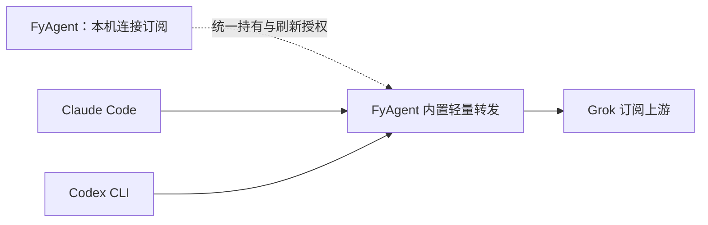

# 订阅跨 Agent：多方案比较与本机资源影响

> 2026-09-08 实施更新：本次选择 FyAgent 内置本机转发。执行与结果以同名 Trellis 任务为准，完成后归档至 `.trellis/tasks/archive/2026-09/08-31-grok-first-class-iteration/`；下文未测试的表述是此前选型阶段的事实边界。当前支持范围和订阅协议见本目录 README。

日期：2026-09-08。衔接 [产品技术方案](./README.md)。

最新产品约束：面向小白用户、单台设备使用，不建设 FyAgent 云账号、服务器或外部同步，也不要求用户安装 Docker。**本轮已收敛为补齐 FyAgent 现有内置轻量转发，CLIProxyAPI 仅保留为技术替代储备。** 下文保留此前多方案比较；远端和完整平台行是排除依据，不是当前待开发功能。本轮不安装服务，不运行代理或真实订阅测试。

## 1. 先回答：本地运行是否会消耗电脑资源

会，但需要区分“代理转发”和“本地模型推理”。本案讨论的网关主要负责认证、请求转换、网络转发和统计；模型仍由上游服务计算。它不因为支持 Grok 就需要在电脑上下载模型或占用 GPU。Claude Code/Codex 执行编译、测试、索引等工具时造成的负载，也应与转发进程分开计算。

资源影响取决于部署了什么：复用 FyAgent 现有转发模块、增加一个原生小进程，以及在 Docker 中启动网关、数据库和缓存，是三种不同的负担。

| 资源或影响 | 主要来源                                                          | 需要控制什么                                                       |
| ---------- | ----------------------------------------------------------------- | ------------------------------------------------------------------ |
| CPU        | JSON/SSE 解析、协议转换、TLS、统计、日志、授权刷新                | 避免空闲忙轮询；流式处理；限制并发与无意义重试                     |
| 内存       | 服务基础占用、连接和请求缓冲、账号元数据；完整平台另有数据库/缓存 | 限制正文、队列和缓存；避免无界缓冲长上下文或重复保存完整流         |
| 磁盘       | 程序、配置、凭据存储、日志；容器镜像、数据库和虚拟磁盘            | 日志轮转、保留期、脱敏；默认不持久保存完整请求/响应                |
| 电池与休眠 | 常驻进程、频繁刷新/额度轮询、后台服务或虚拟机                     | 按需运行；空闲不忙等；明确退出和睡眠后的恢复方式                   |
| 网络       | 转发请求、刷新、必要元数据查询                                    | 本机环回连接不等于公网流量翻倍；远端网关多一个网络节点，延迟需实测 |
| 使用行为   | 目标 Agent 依赖所选 endpoint；端口、配置、进程生命周期            | 只修改用户选择的 Agent；服务停止时有可理解的提示和恢复入口         |

以上是机制分析，不是某台电脑的实测值。本轮没有统一工作负载下的 CPU、峰值内存、耗电和延迟数据，不承诺“只有几十 MB”“完全无感”或“远程一定更快”。发布的最低机器配置也不能当作程序实际常驻内存。

目标只是给特定 Agent 提供模型入口：可以只监听环回地址并只修改该 Agent 的服务地址，不需要开启系统级全局代理，也不需要截获电脑其他应用的流量。

## 2. 什么才算核心功能成立

本轮比较继续以 **用户自己的 Grok / SuperGrok 订阅来源供 Claude Code 和 Codex 使用** 为主线。API Key 直连、购买第三方平台额度、换成另一个本地模型，都可以是其他产品能力，但不能替代这一目标。

一条路线至少需要同时覆盖：

1. 该订阅账号可完成授权，且授权失效、刷新和取消有明确行为。
2. Claude Messages 与 Codex Responses（含目标版本使用的流式/工具调用形式）都能正确适配。
3. 请求明确绑定到选择的订阅账号，不靠其他账号或 API 计费来源静默兜底。
4. 能保存目标配置、回读并恢复；保存成功不等于目标进程已采用。
5. 多个 Agent 同时使用时，刷新责任唯一，额度不足和上游限制能正确归因。

本轮“源码支持”仅表示找到对应实现或固定版本材料；“真实可用”需要后续运行验证。单独支持 `xai` 模型名不证明支持 SuperGrok 订阅。

## 3. 架构级对比

这里的资源高低是基于组件构成的相对判断，不是跑分。“适合情况”记录一般适用场景；当前产品仅采用本机内置路线，不据此规划团队或远端版本。

| 路线                              | 本机额外负担                                                 | 用户配置难度                   | 核心功能证据                                                      | 主要代价                                     | 适合情况                                             |
| --------------------------------- | ------------------------------------------------------------ | ------------------------------ | ----------------------------------------------------------------- | -------------------------------------------- | ---------------------------------------------------- |
| 目标 CLI 原生直连 + 凭据 helper   | 最少；没有额外常驻模型网关                                   | 协议和认证都原生支持时较低     | 对 API endpoint 有公开接入能力；两家 CLI 共同使用订阅仍缺充分证据 | helper 不自动解决协议和订阅认证差异          | 逐目标已经证明能原生直连时                           |
| 复用 FyAgent 现有进程内转发       | 不新增独立网关进程或数据库；现有应用内增加请求处理           | 若产品闭环完成，可做到一次安装 | 0.4.4 已有 xAI 认证与 Claude/Codex 转发源码；一键应用有缺口       | FyAgent 承担兼容维护；关闭应用可能中断入口   | 优先收完现有产品、减少重复部署                       |
| 成熟轻量引擎作为本地原生 sidecar  | 新增一个服务进程；可免容器和独立数据库                       | 包装好后较低，手动装配则较高   | 需核实具体引擎的订阅与协议支持                                    | 进程管理、更新、授权存储及配置连接需要集成   | 面向个人用户，既要本地凭据控制又要复用引擎           |
| 轻量引擎部署在已有远端主机        | 本机仅有客户端连接                                           | 已有服务时低；从零部署时高     | 与所选引擎有关，不能只按部署位置判断                              | 网络、远端凭据保管、运维、服务器成本         | 用户已有服务器、常开设备或团队基础设施               |
| 完整网关平台部署在远端            | 本机较低；服务器承担数据库、缓存和后台                       | 终端用户可低，运维者较高       | 例如 Sub2API 固定版本已有 Grok OAuth 与多协议材料                 | 管理权限、租户/账号绑定、平台运维            | 团队、多用户、集中管理和用量统计                     |
| 完整网关平台部署在用户本机 Docker | 通常比原生转发进程组件更多；桌面容器还需计算虚拟机等宿主开销 | 对普通用户最高                 | 功能取决于平台，部署到本机不会自动补足认证能力                    | 容器、数据库、缓存、后台服务和升级的整体负担 | 已在维护此类环境的专业用户；不宜默认要求普通用户安装 |

“集成 SDK”也不天然更轻：必须核对语言与运行时。把 Go SDK 接到现有 Rust/Tauri 中，不应先承诺零额外进程；清晰的独立进程边界可能比维护跨语言桥更简单。反过来，若已有 Rust 转发模块能补齐目标，也不能仅为了采用新项目而额外运行第二套引擎。

## 4. 现成实现的定点比较

比较的是“已有项目能帮我们承担多少工作”，不是仅比较项目宣传的模型列表。以下均未进行真实账号调用或资源测量。

| 实现与核对版本                                | Grok 订阅与目标协议                                                                                                     | 本机部署组件                                                           | FyAgent 仍需完成                                                   | 本次定位                                                    |
| --------------------------------------------- | ----------------------------------------------------------------------------------------------------------------------- | ---------------------------------------------------------------------- | ------------------------------------------------------------------ | ----------------------------------------------------------- |
| FyAgent `0.4.4`                               | 已有 Managed Auth、xAI OAuth/刷新与 Claude/Codex 转发代码；新版配置应用仍有阻断                                         | 复用当前 Rust/Tauri 应用内服务                                         | 收完逐目标应用、状态、退出行为和真实调用闭环                       | **当前采用方向**：补齐已有授权到逐目标应用的闭环            |
| CLIProxyAPI `v7.2.154`                        | 固定版本有 xAI device OAuth/refresh、订阅上游与 Responses executor；已找到 Claude 请求转换及响应反向转换的注册/调用路径 | 可用原生单个 Go 服务进程；基础部署不要求 PostgreSQL/Redis/Docker       | 进程生命周期、管理登录连接、凭据归属、指定账号路由、逐目标应用     | **技术替代储备**：现有模块出现明确兼容或维护阻碍时再评估    |
| Sub2API `v0.1.176`                            | 固定版本有 Grok OAuth、Claude Messages、Responses 及账号管理接口                                                        | 标准部署包含 Go 服务、PostgreSQL、Redis；本机容器方案还计入容器宿主    | 普通用户授权接口、指定账号/组绑定、目标 key 与配置投放             | **当前排除**：平台管理与部署范围超出本产品需求              |
| grok2api `44a390b8`                           | 项目材料明确列 Grok Build OAuth/Device OAuth、Messages、Responses；Web/Console SSO 为其他来源                           | Go 网关和管理界面；单实例可用 SQLite/内存，多实例可加 PostgreSQL/Redis | 锁定发布产物、只选择目标订阅来源、接入授权与账号绑定、验证目标协议 | **Grok 专用备选**；不能仅凭 README 的能力表判定比前两者成熟 |
| Hermes Agent `v2026.5.28` 发布材料与 xAI 文档 | 已有订阅 OAuth/刷新和 `hermes proxy` xAI 上游；未找到同一代理覆盖 Claude Messages 的充分材料                            | Hermes/Python 环境和代理进程                                           | Claude Messages 适配证据及两个目标的完整闭环                       | 已在使用 Hermes 时有复用价值；目前只能列为部分满足          |
| LiteLLM 官方 xAI 接入文档                     | 文档提供 xAI API Key 接入；本轮未找到取得/刷新 SuperGrok 订阅授权的对应能力                                             | 另一个通用网关及所选功能依赖                                           | 仍需额外的订阅接入实现                                             | 不能单独解决核心需求；本案不为通用路由再叠加一层            |

### 4.1 CLIProxyAPI：确实有轻量实现，但不是复制 token 的工具

核对 commit 为 `ba7e55836dee959e93ec6d41395865d9ec535086`。它的 xAI 认证代码包含设备码授权和刷新，明确区分 API Key 的 `api.x.ai/v1` 与 OAuth 的 `cli-chat-proxy.grok.com/v1`。令牌保存在服务的 `auth-dir`，因此改为远端部署也意味着授权持有者移到远端；不能把部署位置当成纯性能开关。[认证实现](https://github.com/router-for-me/CLIProxyAPI/blob/ba7e55836dee959e93ec6d41395865d9ec535086/internal/auth/xai/xai.go)、[上游定义](https://github.com/router-for-me/CLIProxyAPI/blob/ba7e55836dee959e93ec6d41395865d9ec535086/internal/auth/xai/types.go)、[存储实现](https://github.com/router-for-me/CLIProxyAPI/blob/ba7e55836dee959e93ec6d41395865d9ec535086/internal/auth/xai/token.go)

原生二进制可直接运行，不要求把完整容器平台交给用户。FyAgent 若采用它，需要管理启动、停止、端口、版本和登录入口；“现成引擎”减少的是协议核心的重复实现，并不会自动完成桌面产品体验。[固定版本发布产物](https://github.com/router-for-me/CLIProxyAPI/releases/tag/v7.2.154)、[官方快速开始](https://github.com/router-for-me/CLIProxyAPIDocs/blob/main/docs/en/introduction/quick-start.md)

Claude → xAI 的证据不只来自兼容性宣传：固定版本将 xAI 账号注册给 `XAIAutoExecutor`，请求准备代码读取来源协议并转换为 `FormatCodex`；translator 注册了 `Claude → Codex` 请求转换和返回 Claude 的响应转换，HTTP executor 再向 xAI `/responses` 发送请求。这证明了实现路径，仍不保证所有工具类型、流式边界和目标 CLI 版本都已运行通过。[executor 注册](https://github.com/router-for-me/CLIProxyAPI/blob/ba7e55836dee959e93ec6d41395865d9ec535086/sdk/cliproxy/service_executors.go#L295)、[请求转换调用](https://github.com/router-for-me/CLIProxyAPI/blob/ba7e55836dee959e93ec6d41395865d9ec535086/internal/runtime/executor/xai_executor_request.go#L58)、[translator 注册](https://github.com/router-for-me/CLIProxyAPI/blob/ba7e55836dee959e93ec6d41395865d9ec535086/internal/translator/codex/claude/init.go#L10)、[发送与响应转换](https://github.com/router-for-me/CLIProxyAPI/blob/ba7e55836dee959e93ec6d41395865d9ec535086/internal/runtime/executor/xai_executor_execute.go#L36)

### 4.2 Sub2API 与 grok2api：能力更多，按实际组件比较

Sub2API 本次核对的主项目是 `Wei-Shaw/sub2api`，commit `e803e3851c0a7e222cfadeafad7b8636ab959d11`。它已有较完整的账号和用量管理能力，但标准服务需要 PostgreSQL 和 Redis。相关 OAuth 管理权限与历史连接器缺口见主方案附录 A；当前不实施该连接器。[固定版本说明](https://github.com/Wei-Shaw/sub2api/blob/e803e3851c0a7e222cfadeafad7b8636ab959d11/README.md)

grok2api 核对的是 `chenyme/grok2api` 的 main 快照 `44a390b890e7a3e0dd209b95b8c29a9f2b1be8dd`，不是本轮验证过的稳定发布包。其材料区分 Build OAuth、Web SSO、Console SSO，并列出两种目标协议；单实例不必采用 PostgreSQL/Redis。本需求只评估与目标订阅对应的 Build OAuth 路线，不能把其他 SSO 来源的成功混作该路线的证据。[固定快照说明](https://github.com/chenyme/grok2api/blob/44a390b890e7a3e0dd209b95b8c29a9f2b1be8dd/README.md)

在 macOS 上选择 Docker Desktop，还要计算其虚拟机和容器宿主开销。Docker 的 CPU/内存配置是资源上限，不能当成实际使用量；空闲节能能力也不能据此推断常开数据库容器的实际耗电。[Docker 官方资源设置](https://docs.docker.com/desktop/settings-and-maintenance/settings/)

### 4.3 为什么没有直接推荐 Hermes 或 LiteLLM

Hermes 的材料能支撑“订阅授权 + 对外提供 OpenAI 兼容入口”，但尚不足以直接判定本案要求的 Claude Code 与 Codex 两条链路都成立。若为了补齐 Claude 再套一层转换，是否还比已有引擎简单就需要重新算账。[Hermes xAI OAuth 文档](https://github.com/NousResearch/hermes-agent/blob/main/website/docs/guides/xai-grok-oauth.md)、[代理能力发布说明](https://github.com/NousResearch/hermes-agent/releases/tag/v2026.5.28)

LiteLLM 的 xAI 文档使用 API Key。它的通用协议能力不能补上缺失的订阅授权取得和刷新，所以本轮不把它列为独立替代方案。这是本次材料范围的判断，不是断言项目永远不会支持。[LiteLLM 官方 xAI 接入](https://docs.litellm.ai/docs/providers/xai)

## 5. 当前取舍：收完 FyAgent 内置轻量转发

**在当前单机、小白用户的约束下，采用现有内置转发最合适。** 这是一项产品和工程取舍；当前没有性能对测，因此不声称其 CPU 或内存已经胜过所有第三方引擎。

| 决策                            | 理由                                                                                                   |
| ------------------------------- | ------------------------------------------------------------------------------------------------------ |
| 首先补齐 FyAgent 已有模块       | 已有本机授权、刷新与协议转发基础，能继续使用现有安装包和凭据模型；需要收完逐目标应用和后台行为         |
| CLIProxyAPI 保留为替代储备      | 其现成转换能力有价值，但当前替换会增加跨进程、凭据和版本管理工作；有明确能力或维护阻碍时再比较替换收益 |
| 当前不做远端连接、云账号或同步  | 产品以单设备为边界，没有相应使用需求；服务管理和外部凭据保管会增加额外工作                             |
| 当前不引入 Docker 完整平台      | 单机转发无需用户承担完整数据库和容器平台的安装维护                                                     |
| 不把 token 文件复制作为通用方案 | 多目标仍需要匹配协议、唯一刷新责任和明确的订阅来源；本机转发可以统一处理                               |

产品中的订阅账号是供应商的 Grok 身份，其授权保存在本机；无需为了复用订阅建立另一套 FyAgent 账号体系。多个本机 Agent 共享该来源，各自的配置和取消行为独立。

推荐体验是“连接订阅 → 选择 Agent → 应用”。转发随 FyAgent 提供，用户无需手工安装或认识代理项目。只监听本机环回地址、校验客户端访问凭据、只修改选定目标配置，并限制日志、缓冲与后台轮询。

首版建议复用应用内服务：关闭窗口后可保持托盘运行；彻底退出时停止服务，明确告知连接依赖；重新打开应用恢复已启用入口。这些是待实现和验证的行为约定，不能描述成当前版本已经全部具备。若后续提出彻底退出应用后仍需调用，另评估随应用交付的原生后台服务；不自动扩大为 Docker 或云端方案。

因此，本次不再让用户在本地、远端和平台部署中继续选择。实现顺序、当前结构和旧方案的研究留档见 [主技术方案](./README.md)。

## 6. 后续用什么证据决定资源是否合格

等用户进入验证阶段后，以同一台目标机器、同一上游账号与同一请求负载比较，先分离原有 FyAgent/Agent 的基础负载，再记录新增部分：

- 未连接、已连接空闲、单个流式请求、两个 Agent 并发、长上下文、授权刷新、退出等场景。
- CPU 平均值与峰值、常驻和峰值内存、日志/数据增长、进程数量、是否有 GPU 活动和明显后台唤醒。
- 代理自身处理时间、首次响应和完整响应时间；把上游网络/生成时间与本地处理分开。
- 睡眠恢复、端口冲突、上游限流、服务退出、取消请求、CLI 被关闭后的连接与进程清理。
- 当前进程内方案报告 FyAgent 的增量，不能拿整个界面 RSS 当代理开销。仅在将来有明确理由重开替代选型时，再比较其他引擎的完整组件成本；本期不为横比而搭建容器平台。

性能目标应先在基线机器上约定，再做采用决定。本轮不为给出漂亮数字启动服务或进行账号调用。
