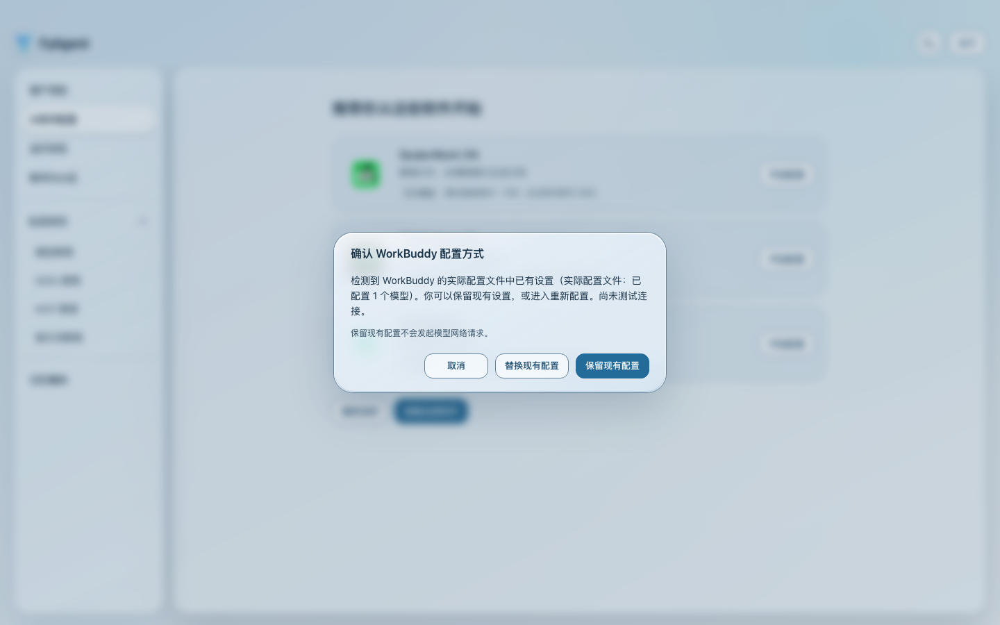

# 当前流程演示素材

采用版本：0.4.6，源码提交 `fac051ea19f6b2d4be69b490cde918a8c8ab5fd4`。
采集时源码已提交且无修改，采集前后摘要一致。使用实际页面组件与隔离的演示数据，
展示首次用途选择、软件入口、保留已有配置、保存预览及失败恢复状态。

[主流程视频，25.8 秒](current-flows.webm) · [主流程字幕](current-flows.zh-CN.vtt)

[独立成功场景，4.56 秒](saved-result.webm) · [成功场景字幕](saved-result.zh-CN.vtt)



这些素材展示界面操作。保存、失败及恢复结果来自 fixture，不代表真实账号登录、
安装器运行、原生文件回滚、Windows 实机或正式发布验证。成功视频使用另一组独立
演示数据，不应剪成失败场景的真实重试结果。

## 文件与使用位置

| 文件                       | 操作说明中的位置及替代文本                           |
| -------------------------- | ---------------------------------------------------- |
| `01-purpose.png`           | 首次使用：选择主要用途，也可跳过引导。               |
| `02-recommendations.png`   | 软件推荐：办公用途推荐说明，并提供配置入口。         |
| `02-existing-config.png`   | 已有设置：保留或替换，确认前不修改配置。             |
| `02-software-setup.png`    | 软件详情：查看 WorkBuddy 状态并进入模型配置。        |
| `03-save-preview.png`      | 保存前：核对文件、备份位置和实际变化。               |
| `04-recovered-failure.png` | 保存失败：查看演示数据返回的恢复状态。               |
| `05-saved-result.png`      | 保存成功：独立演示数据返回完成状态，凭据输入已清空。 |
| `current-flows.webm`       | 入门说明中的主流程；配同名中文字幕文件。             |
| `saved-result.webm`        | 成功结果补充说明；配同名中文字幕文件。               |

## 播放与复现

在仓库根目录运行以下命令，再用浏览器打开 `http://127.0.0.1:4199/index.html`：

```sh
mise run python:run -- python -m http.server 4199 --bind 127.0.0.1 --directory docs/fyagent/development/demos/0.4.6-fac051ea
```

完整复现方法见 [采集说明](../../usage-demo.md)。使用 HTTP 播放器可加载独立 VTT
字幕；不应仅用 `file://` 打开后把字幕加载失败当作视频结果。

原始视频保存在 `raw/`，与采用视频逐字节一致。[采集清单](manifest.json) 保留源码、
版本、字幕时间和素材哈希；[采用记录](adoption.json) 记录原始视频哈希及验证范围。
七张截图与七个视频字幕区间的画面已检查，完整视频解码、Chromium 整段播放与字幕
回读已通过。Codex 内置预览在点击播放时崩溃，其播放能力未通过本次验收。

发布素材时保留以上数据范围说明。没有真实账号、真实密钥或个人绝对路径；画面中的
`~/.workbuddy/` 是产品展示的通用配置位置。尚未向仓库之外的公开站点发布素材。
