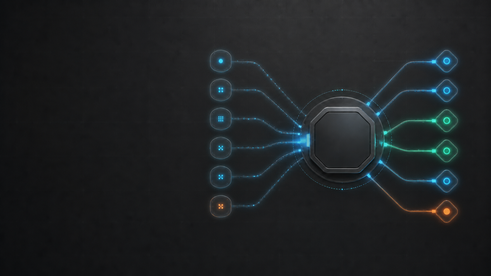

# FyAgent 触觉化软件编排主视觉样例 v2

这张样例把 VibeKey “一个动作、一个状态”的控制感转译为 FyAgent 的软件编排隐喻。它不是硬件产品图、真实 UI 截图或已经批准发布的品牌母版。由于左右线路的网格、端口和弯折规则不一致，已经由 [v3 对称线路版](visual-direction-sample-v3.md) 替代。



## 相比 v1 的变化

- 中心保留完全空白的八边形徽章位，避免模型重画 FyAgent Logo。
- 参考 VibeKey 的触觉层级和状态反馈，但不复制键盘、屏幕、按键布局或文字。
- 初稿两侧模块像 USB 设备，已做一次单变量迭代，改成软件配置 token 与发光数据轨道。
- v1 保留为第一轮探索记录；v2 验证了构图和材质方向，但线路完成度不足，现已被 v3 替代。

## 主提示词

```text
Use case: ads-marketing
Asset type: FyAgent website and README hero concept, 16:9 landscape
Input images: Image 1 is a historical VibeKey concept reference. Use it only for tactile material quality, obvious control hierarchy, and the feeling that one action has a visible state. Do not reproduce its keyboard, labels, screen, layout, or hardware product.
Primary request: visualize FyAgent as one calm desktop control layer that turns scattered AI-tool configuration into a deliberate, understandable switch action. Translate the useful tactile immediacy of VibeKey into an abstract software-control metaphor, not a physical device.
Scene/backdrop: deep graphite background with a very subtle precision grid and large quiet negative space.
Subject: on the right 58% of the canvas, a compact floating engineered control rail. Several small abstract configuration cartridges converge through clean routes into one central selector, then branch into six minimal endpoint ports. One route is visibly active and healthy. Include a recessed blank octagonal badge plate for later deterministic placement of the real FyAgent logo; the plate must contain no symbol or mark.
Style/medium: premium precision 3D-and-vector hybrid for a serious developer desktop tool; satin dark metal, translucent technical glass, crisp geometry, restrained depth, believable controls.
Composition/framing: wide 16:9; left 38% is uncluttered safe space for headline and CTA; right-side focal object remains inside the central 80% safe zone; clear visual flow from scattered inputs to one selector to coordinated outputs.
Lighting/mood: calm studio lighting, crisp edge highlights, trustworthy and controlled rather than futuristic spectacle.
Color palette: graphite and near-black base, electric blue and cyan/teal signal paths, one small warm orange status accent, a restrained green healthy-state indicator; avoid purple.
Constraints: no text, no letters, no numbers, no logos, no brand names, no third-party icons, no invented application UI, no keyboard, no keycaps, no screen, no laptop, no people, no watermark. Do not imply FyAgent is hardware. Keep the left copy area empty and high-contrast.
```

## 单变量修订提示词

```text
Use case: precise-object-edit
Input images: Image 1 is the current FyAgent hero concept draft.
Primary request: change only the dongle-like side modules and physical cables. Replace them with abstract flat software configuration tokens and thin luminous data lanes, so the scene unmistakably reads as desktop software orchestration rather than a USB hub or hardware product.
Constraints: preserve the exact 16:9 composition, deep graphite background, empty left headline safe area, right-side focal placement, central blank octagonal badge plate, cyan/blue/green signal state, one restrained orange accent, lighting, materials, and overall premium developer-tool art direction. Keep the central badge fully blank with no symbol. No text, letters, numbers, logos, brand names, third-party icons, application UI, keyboard, keycaps, screen, laptop, people, connector plugs, USB devices, physical cables, or watermark.
```

## 生成记录

| 字段             | 值                                                                 |
| ---------------- | ------------------------------------------------------------------ |
| 模式             | ChatGPT built-in image generation                                  |
| 历史参考         | 本地 VibeKey 概念图，仅参考材质、控制层级和状态反馈                |
| 历史参考 SHA-256 | `BD5DB121CEE6ACAEB0F3D706E2054ED7B54B492878E4BBAB85AD260F82B8FB86` |
| 输出             | `assets/samples/fyagent-tactile-orchestration-hero-v2.png`         |
| 尺寸             | 1672×941                                                           |
| 文件大小         | 1,553,252 bytes；concept 阶段未做发布压缩                          |
| SHA-256          | `4B3328E85352A61C579B403CF61703634213BB9C7E647C3D956DC45FBDBC5F40` |
| 内嵌文字 / Logo  | 无 / 无；中心徽章位为空                                            |

## 视觉评审

通过：

- 左侧留白足以承载外部标题和单一 CTA，右侧焦点稳定。
- “多个配置入口 → 一个控制中枢 → 多个工具结果”的信息流无需文字即可理解。
- 中心徽章位为空，允许后期使用项目原始 Logo 确定性合成。
- 没有第三方 Logo、假 UI、键盘、屏幕、紫色 SaaS 渐变或生成文字。
- 第二版已明显弱化 USB Hub / 实体硬件含义。

限制：

- 中央体仍带有控制面板和工程材料感，正式页面必须配合“桌面应用”文案及真实 UI proof frame，避免被误读为硬件。
- 左右节点是抽象数量，不代表支持工具或供应商的准确数量。
- 只验证了桌面 16:9 构图；1200×630、4:5、1:1 与移动端需要独立版本。
- 尚未叠加原始 Logo、标题、CTA，也未做 WebP/AVIF 压缩和实际网页可访问性检查。
- 证据等级是 `generated_asset_visual_inspection`，不能替代 `runtime_screenshot` 或 `pixel_diff`。

## 发布前工作

1. 在中心空白徽章位嵌入未经修改的 `assets/fyagent.png`，不由模型重画。
2. 以 HTML/SVG 排版标题、副标题和 CTA，保证文字可选中、可本地化并满足对比度。
3. 分别制作 16:9、1200×630、4:5、1:1，不以自动裁切替代构图检查。
4. 在同一页面紧邻放置真实 FyAgent 运行时截图，建立“概念解释 + 产品证据”关系。
5. 完成品牌、第三方标识、文件体积、响应式裁切和 alt 文本审计后，才能从 `concept_candidate` 升级。
