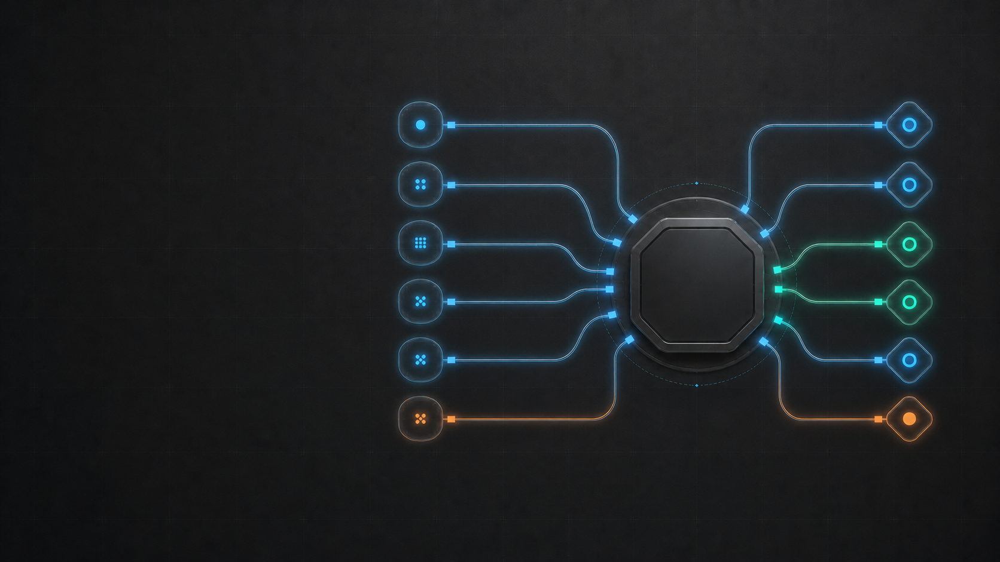

# FyAgent 触觉化软件编排主视觉样例 v3

v3 只修正 v2 的线路系统：保留左侧文案安全区、中心空白徽章位、节点、材质和颜色，用统一网格重新组织六路输入与六路输出。它仍是概念样例，不是真实 UI 截图或已经批准发布的品牌母版。



## 相比 v2 的变化

- 左右各六个节点采用一致的垂直节奏，形成可辨认的对应关系。
- 每条线路都从节点完整连接到中心端口，不再出现悬空短线、随机断头或含糊的接入关系。
- 统一线路粗细、发光强度、弯折半径和端口造型，中心附近保持有纪律的平行间距。
- 保留两条绿色健康状态和底部橙色提醒状态；节点数量只表达“多入口、多出口”，不代表准确的工具数量。

## 定向修订提示词

```text
Use case: precise-object-edit
Asset type: FyAgent website and README hero concept, wide 16:9 landscape
Input images: Image 1 is the edit target and current FyAgent tactile orchestration hero v2.
Primary request: refine only the routing-line system so it looks deliberately engineered, balanced, and production-grade.
Composition/framing: preserve the entire current composition: large clean dark copy space on the left, the central octagonal blank badge plate at the same position and scale, six rounded-square source nodes on the left of the hub, six diamond destination nodes on the right, and the same dark industrial control-surface environment. Use one coherent geometric routing grid. Make the left and right networks visually balanced around the horizontal centerline even though node shapes differ. Use exactly six routes entering the hub from the left and exactly six routes leaving the hub to the right. Align source and destination node centers to six corresponding horizontal lanes with equal vertical rhythm. Give every route the same stroke family, glow strength, corner radius, connector treatment, and intentional port geometry. Every visible route must fully connect from its node to a clearly aligned hub port. No floating fragments, accidental short stubs, broken lines, dead-end segments, crossing routes, doubled lines, mismatched joins, or inconsistent endpoint gaps. Keep route curves smooth and symmetric in visual weight, with disciplined parallel spacing near the hub.
Lighting/mood: retain the restrained cyan/blue system glow, two green healthy routes on the right, and one orange warning route at the bottom on each side; keep overall lighting and contrast unchanged.
Materials/textures: preserve the current matte graphite background, subtle grid, glassy nodes, machined metal hub, and tactile premium finish.
Constraints: change only the route geometry, route ports, and minimal adjacent glow needed to integrate them. Keep the central badge completely blank for later deterministic FyAgent logo placement. Preserve the left copy-safe area. Preserve every node count, node type, node icon, node color role, hub design, camera angle, background, palette, and aspect ratio. No text, no logo, no letters, no watermark.
Avoid: hardware keyboard appearance, USB cables, messy circuitry, decorative disconnected traces, asymmetrical lane spacing, random bends, extra nodes, missing nodes, fake interface panels.
```

## 生成记录

| 字段            | 值                                                                 |
| --------------- | ------------------------------------------------------------------ |
| 模式            | ChatGPT built-in image generation，`precise-object-edit`           |
| 编辑目标        | `assets/samples/fyagent-tactile-orchestration-hero-v2.png`         |
| 输出            | `assets/samples/fyagent-tactile-orchestration-hero-v3.png`         |
| 尺寸            | 1672×941                                                           |
| 文件大小        | 1,718,652 bytes；concept 阶段未做发布压缩                          |
| SHA-256         | `C0EBE3C401B077DE804A37C3C0D4CC65000125121D4E19A366BF9FD2E5E78555` |
| 内嵌文字 / Logo | 无 / 无；中心徽章位为空                                            |

## 视觉评审

通过：

- 六路输入和六路输出均有明确节点、连续线路与中心端口。
- 左右视觉重量、节点节奏和线路层级比 v2 更平衡，未接入的装饰性断线已经移除。
- 左侧仍保留足够的标题与 CTA 安全区，中心徽章位保持空白。
- 没有第三方 Logo、假 UI、键盘、USB 插头、生成文字或水印。

限制：

- 中央主体仍有触觉控制器的工程材质，正式页面需要配合“桌面应用”文案和真实运行时截图。
- 当前只检查了桌面 16:9 构图；其他渠道需要独立构图，不能直接裁切。
- 尚未合成原始 Logo、标题和 CTA，也未做网页压缩、响应式或可访问性检查。
- 证据等级是 `generated_asset_visual_inspection`，不能替代 `runtime_screenshot` 或 `pixel_diff`。

## 发布前工作

1. 在中心空白徽章位确定性嵌入未经修改的 `assets/fyagent.png`。
2. 使用 HTML/SVG 排版标题、副标题和 CTA，保证文字可选中、可本地化并满足对比度。
3. 为 1200×630、4:5、1:1 和移动端分别重构，不用自动裁切代替视觉检查。
4. 在同一页面紧邻放置真实 FyAgent 运行时截图，明确区分概念解释和产品证据。
5. 完成品牌、第三方标识、文件体积、响应式裁切和 alt 文本审计后，才能升级状态。
