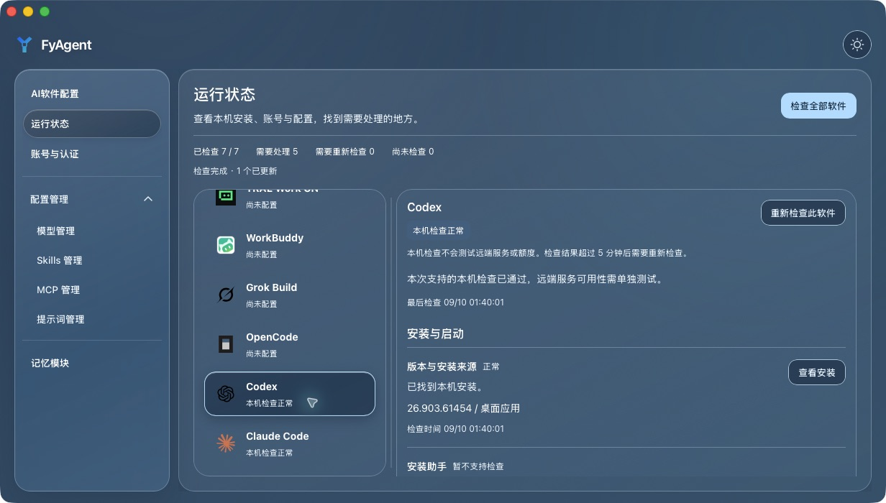

# 查看软件运行状态

在侧栏打开「运行状态」，或在 Agent 卡片点击「查看状态」。
选择软件后，FyAgent 会读取本机安装、配置和已有运行记录。
「检查全部软件」会依次检查全部七款软件；点击停止后，
当前检查可以完成，但不会继续检查下一款。

## 怎么看结果

| 状态         | 含义                                                   |
| ------------ | ------------------------------------------------------ |
| 本机检查正常 | 当前支持的本机检查通过；不表示服务端额度或网络一定可用 |
| 需要处理     | 存在需要关注的问题，或关键事实尚无法确认               |
| 暂不可用     | 已发现阻碍使用的问题，例如代理停止或配置无法读取       |
| 尚未配置     | 尚未发现所需安装或配置                                 |
| 需要重新检查 | 结果超过五分钟，或重新检查失败；原结果和时间会保留     |

详情包括安装版本与来源、安装助手、安装冲突、配置、凭据、
服务地址、认证、模型、配置变化、代理、重启和最近请求。
每项都会说明检查结果、时间，以及可用的处理入口。
软件尚不支持提供某项信息时，会直接显示「暂不支持检查」。

## 处理问题

点击条目旁的按钮，进入现有安装、账号或模型配置页面处理。
状态页不会代你修改配置、重新登录或发起付费请求。
处理后返回状态页，重新读取本机状态。

「凭据已配置」说明本机存在相关材料；官方账户的连接状态是另一项检查。
「最近请求成功」来自此软件已有的本机代理请求记录，
不是一次新测试，也不代表当前服务仍然可用。
需要确认实际请求时，进入模型配置页面，检查测试内容后再执行。

页面只在可见时派发检查，不会在后台定时扫描。
搜索和状态筛选用于定位软件，不会改变软件自身配置。

## 界面示例

下图来自 macOS 原生调试包的隔离测试，展示处理配置问题后恢复的状态与选中项；示例数据不代表真实账号的远端可用性。

