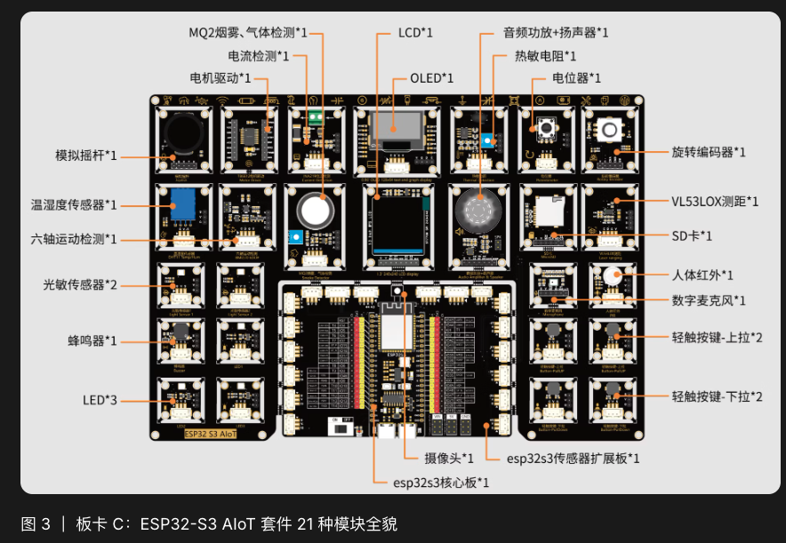
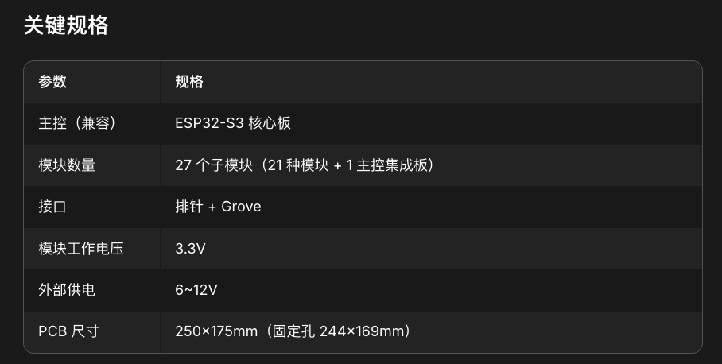

# 板卡 C：ESP32-S3 AIoT 套件工程基线

## 已核对规格

| 参数 | 当前基线 |
| --- | --- |
| 主控兼容 | ESP32-S3 核心板、Wifiduino32S3 |
| 模块规模 | 官方写法为 27 个子模块、共 21 种模块和 1 个主控集成板；实际数量需到场清点 |
| 接口 | 排针 + Grove |
| 模块工作电压 | 3.3V |
| 外部供电 | 6–12V |
| PCB 尺寸 | 250 × 175 mm |
| 固定孔中心距 | 244 × 169 mm |
| 开发环境 | ESP-IDF、Arduino IDE、Ailyblockly；本次 `agent_link` 路径以 ESP-IDF 为准 |

## 21 种模块

1. 摇杆
2. 电流检测 INA219
3. 电机驱动
4. 六轴运动 BMI270
5. 光敏
6. MQ2 烟雾
7. DHT11 温湿度
8. 1.3 英寸 LCD / ST7789
9. OLED / SSD1306
10. 热敏检测
11. 音频功放
12. 旋转编码器
13. 电位器
14. MicroSD
15. 激光测距 VL53L0X
16. 数字麦克风
17. 人体红外 PIR
18. LED
19. 蜂鸣器
20. 上拉按键
21. 下拉按键

另配摄像头、ESP32-S3 核心板和传感器扩展板。赛前说明明确：现场不提供电机，因此本项目不依赖电机或电机驱动。

## 官方固定引脚

| 模块 | 引脚 |
| --- | --- |
| LCD | SCL 21、SDA 47、DC 43、CS 44 |
| 音频功放 | LR 40、BC 39、DIN 38 |
| SD 卡 | MISO 35、CLK 3、MOSI 14、CS 46 |
| 数字麦克风 | WS 42、SD 2、SCK 41 |
| 摄像头 | SDA 4、SCL 5、VS 6、HS 7、XCLK 15、Y9 16、Y8 17、Y7 18、Y4 8、Y3 9、Y5 10、Y2 11、Y6 12、PCLK 13 |
| 板载 WS2812 | IO48 |

## 赛前说明中的常用模块示例引脚

| 模块 | 示例引脚 |
| --- | --- |
| LED / 蜂鸣器 | IO9 |
| 摇杆 | X IO1、Y IO2、按键 IO3 |
| 光敏 | IO18 |
| 电位器 | IO13 |
| DHT11 | IO8 |
| MQ2 | 模拟 IO15、数字 IO14 |
| 热敏 | 模拟 IO5、数字 IO4 |
| PIR | IO16 |
| 旋转编码器 | CLK 6、DT 7、按键 8 |
| 上拉键 | IO12 |
| 下拉键 | IO14 |
| VL53L0X / INA219 | I2C |

这些是参考值，不是本项目最终 pin map。摄像头、编码器、DHT11、SD、MQ2 和按键之间存在明显 GPIO 复用，必须根据最终模块集合重新冻结。

## 与 `agent_link` 的当前关系

- `Agent_link` 当前主分支包含 `boards/gc2145-camera/`，目标为 ESP32-S3，支持 GC2145 DVP 摄像头在 ST7789 240 × 240 LCD 上实时预览。
- 当前官方 README 确认 BLE transport、控制面与设备 I/O 已实现，但语音和设备 I/O 仍标记为“已实现、未在硬件验证”。
- Wi-Fi / USB transport 当前仍为脚手架；`push_video` 只有接口。赛前 Gamma 页面关于 Wi-Fi 已实现的表述，不能作为当前完成证据。
- 本项目外观范围不含摄像头，因此不能直接把 `gc2145-camera` 示例等同于 FyHelm 的完整板级适配。

## 对外壳的直接影响

如果整块扩展板都装入外壳，内部平面尺寸至少要超过 250 × 175 mm，还要额外预留壁厚、插头、线缆弯曲和背盖空间。海绵宝宝正面会接近小型键盘或 A4 页面尺度，而不是手掌设备。

如果只使用核心板和所需模块，可以显著缩小体积，但需要重新确认：

- 每个模块能否从扩展板拆下并通过 Grove / 排针可靠连接；
- 线长、接头高度和固定方式；
- 4 个按钮的独立 GPIO；
- USB-C 与 6–12V 外部供电的最终路径；
- 屏幕 PCB 外框、实际亮屏区和可视角度。

在上述路线未确认前，250 × 175 mm 只能作为整板包络，不是最终壳体尺寸。
